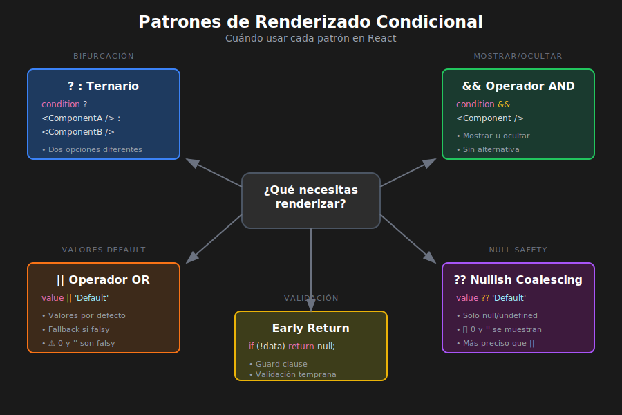

# Renderizado Condicional en React

## 🎯 Objetivos de Aprendizaje

- Dominar el operador ternario en JSX
- Usar correctamente los operadores && y ||
- Aplicar patrones de early return y guard clauses
- Evitar errores comunes con valores falsy
- Extraer lógica condicional a componentes

---

## 📊 Diagrama: Patrones de Renderizado Condicional



---

## 📋 ¿Qué es el Renderizado Condicional?

El **renderizado condicional** permite mostrar diferentes contenidos según el estado o las props del componente.

```tsx
// QUÉ: Ejemplo básico de renderizado condicional
// PARA: Mostrar contenido diferente según una condición
// IMPACTO: La UI se adapta dinámicamente al estado

import React, { useState } from 'react';

const LoginStatus: React.FC = () => {
  const [isLoggedIn, setIsLoggedIn] = useState<boolean>(false);

  // Renderizado condicional con ternario
  return (
    <div>
      {isLoggedIn ? (
        <p>¡Bienvenido de vuelta!</p>
      ) : (
        <p>Por favor, inicia sesión</p>
      )}
      <button onClick={() => setIsLoggedIn(!isLoggedIn)}>
        {isLoggedIn ? 'Cerrar sesión' : 'Iniciar sesión'}
      </button>
    </div>
  );
};
```

---

## 1️⃣ Operador Ternario (`? :`)

El operador ternario es la forma más común de renderizado condicional.

```tsx
condition ? <ComponenteA /> : <ComponenteB />;
```

### Sintaxis Básica

```tsx
// QUÉ: Operador ternario para elegir entre dos opciones
// PARA: Mostrar uno u otro contenido según condición
// IMPACTO: Siempre renderiza algo (nunca null implícito)

import React from 'react';

interface UserBadgeProps {
  role: 'admin' | 'user' | 'guest';
}

const UserBadge: React.FC<UserBadgeProps> = ({ role }) => {
  return (
    <span className={`badge badge-${role}`}>
      {role === 'admin' ? '👑 Administrador' : '👤 Usuario'}
    </span>
  );
};

// Uso
<UserBadge role="admin" />  // Muestra: 👑 Administrador
<UserBadge role="user" />   // Muestra: 👤 Usuario
```

### Ternario con JSX Complejo

```tsx
// QUÉ: Ternario con elementos JSX más elaborados
// PARA: Renderizar componentes completos condicionalmente
// IMPACTO: Cada rama puede contener JSX tan complejo como necesites

import React, { useState } from 'react';

interface User {
  id: number;
  name: string;
  email: string;
}

const UserProfile: React.FC = () => {
  const [user, setUser] = useState<User | null>(null);
  const [loading, setLoading] = useState<boolean>(false);

  return (
    <div className="profile">
      {loading ? (
        // Rama: cargando
        <div className="loading">
          <span className="spinner">⏳</span>
          <p>Cargando perfil...</p>
        </div>
      ) : user ? (
        // Rama: usuario existe
        <div className="user-info">
          <h2>{user.name}</h2>
          <p>{user.email}</p>
        </div>
      ) : (
        // Rama: no hay usuario
        <div className="no-user">
          <p>No hay usuario logueado</p>
          <button>Iniciar sesión</button>
        </div>
      )}
    </div>
  );
};
```

### ⚠️ Evitar Ternarios Anidados Excesivos

```tsx
// ❌ MAL: Ternarios anidados difíciles de leer
const BadExample: React.FC<{ status: string }> = ({ status }) => {
  return (
    <div>
      {status === 'loading' ? (
        <Loading />
      ) : status === 'error' ? (
        <Error />
      ) : status === 'empty' ? (
        <Empty />
      ) : (
        <Content />
      )}
    </div>
  );
};

// ✅ BIEN: Extraer a función o componente
const GoodExample: React.FC<{ status: string }> = ({ status }) => {
  // QUÉ: Función para determinar qué renderizar
  // PARA: Hacer el código más legible
  // IMPACTO: Más fácil de mantener y testear
  const renderContent = (): React.ReactNode => {
    switch (status) {
      case 'loading':
        return <Loading />;
      case 'error':
        return <Error />;
      case 'empty':
        return <Empty />;
      default:
        return <Content />;
    }
  };

  return <div>{renderContent()}</div>;
};
```

---

## 2️⃣ Operador Lógico AND (`&&`)

Renderiza algo **solo si la condición es verdadera**.

```tsx
condition && <Component />;
```

### Uso Correcto

```tsx
// QUÉ: Operador && para renderizado condicional
// PARA: Mostrar algo solo cuando condición es true
// IMPACTO: Si condición es false, no renderiza nada

import React, { useState } from 'react';

interface NotificationBadgeProps {
  count: number;
}

const NotificationBadge: React.FC<NotificationBadgeProps> = ({ count }) => {
  return (
    <div className="notifications">
      <span>🔔</span>
      {count > 0 && <span className="badge">{count}</span>}
    </div>
  );
};

// count = 5 → Muestra: 🔔 5
// count = 0 → Muestra: 🔔 (sin badge)
```

### ⚠️ PELIGRO: El Problema del Cero

```tsx
// ❌ PROBLEMA: El 0 se renderiza en pantalla
const BadMessageCount: React.FC<{ count: number }> = ({ count }) => {
  return (
    <div>
      {/* Si count = 0, React renderiza "0" en pantalla */}
      {count && <span>Tienes {count} mensajes</span>}
    </div>
  );
};

// count = 5 → "Tienes 5 mensajes" ✅
// count = 0 → "0" ← ¡Renderiza el número 0! ❌
```

**¿Por qué sucede esto?**

En JavaScript, `0 && "algo"` devuelve `0` (el primer valor falsy). React renderiza números, así que muestra "0".

```tsx
// ✅ SOLUCIÓN 1: Convertir a booleano explícito
const FixedMessageCount1: React.FC<{ count: number }> = ({ count }) => {
  return <div>{count > 0 && <span>Tienes {count} mensajes</span>}</div>;
};

// ✅ SOLUCIÓN 2: Usar Boolean()
const FixedMessageCount2: React.FC<{ count: number }> = ({ count }) => {
  return <div>{Boolean(count) && <span>Tienes {count} mensajes</span>}</div>;
};

// ✅ SOLUCIÓN 3: Doble negación
const FixedMessageCount3: React.FC<{ count: number }> = ({ count }) => {
  return <div>{!!count && <span>Tienes {count} mensajes</span>}</div>;
};
```

### Valores Falsy en JavaScript

Recuerda qué valores son "falsy" en JavaScript:

```tsx
// QUÉ: Valores falsy que pueden causar problemas
// PARA: Entender cuándo && puede fallar
// IMPACTO: Evitar bugs con renderizado de 0, "", etc.

const falsyValues = [
  false, // No renderiza nada ✅
  null, // No renderiza nada ✅
  undefined, // No renderiza nada ✅
  0, // ⚠️ RENDERIZA "0"
  '', // No renderiza nada ✅
  NaN, // ⚠️ RENDERIZA "NaN"
];

// Regla: Si tu condición puede ser 0 o NaN, usa comparación explícita
```

---

## 3️⃣ Operador OR (`||`) y Nullish Coalescing (`??`)

### Operador OR para Valores por Defecto

```tsx
// QUÉ: Operador || para valores por defecto
// PARA: Mostrar fallback cuando valor es falsy
// IMPACTO: Cuidado con 0 y "" que son falsy válidos

import React from 'react';

interface GreetingProps {
  name?: string;
}

const Greeting: React.FC<GreetingProps> = ({ name }) => {
  return <h1>Hola, {name || 'Invitado'}!</h1>;
};

// name = "Ana" → "Hola, Ana!"
// name = undefined → "Hola, Invitado!"
// name = "" → "Hola, Invitado!" ← ¿Es esto lo que quieres?
```

### Nullish Coalescing (`??`) - Más Preciso

```tsx
// QUÉ: Operador ?? para valores null/undefined
// PARA: Fallback solo si es null o undefined (no 0 o "")
// IMPACTO: Más preciso que || para ciertos casos

import React from 'react';

interface ScoreProps {
  score?: number | null;
}

const Score: React.FC<ScoreProps> = ({ score }) => {
  return (
    <div>
      {/* || fallaría si score = 0 */}
      <p>Puntuación: {score ?? 'Sin puntaje'}</p>
    </div>
  );
};

// score = 100 → "Puntuación: 100"
// score = 0 → "Puntuación: 0" ✅ (con || mostraría "Sin puntaje")
// score = null → "Puntuación: Sin puntaje"
// score = undefined → "Puntuación: Sin puntaje"
```

---

## 4️⃣ Early Return (Retorno Temprano)

Patrón para simplificar condicionales complejos.

```tsx
// QUÉ: Early return para simplificar renderizado
// PARA: Manejar casos especiales al inicio del componente
// IMPACTO: Código más limpio, evita anidación excesiva

import React, { useState, useEffect } from 'react';

interface User {
  id: number;
  name: string;
}

interface UserProfileProps {
  userId: number;
}

const UserProfile: React.FC<UserProfileProps> = ({ userId }) => {
  const [user, setUser] = useState<User | null>(null);
  const [loading, setLoading] = useState<boolean>(true);
  const [error, setError] = useState<string | null>(null);

  useEffect(() => {
    const fetchUser = async () => {
      try {
        setLoading(true);
        const response = await fetch(`/api/users/${userId}`);
        if (!response.ok) throw new Error('Usuario no encontrado');
        const data = await response.json();
        setUser(data);
      } catch (err) {
        setError(err instanceof Error ? err.message : 'Error desconocido');
      } finally {
        setLoading(false);
      }
    };
    fetchUser();
  }, [userId]);

  // Early returns para casos especiales
  if (loading) {
    return (
      <div className="loading">
        <span>⏳</span> Cargando usuario...
      </div>
    );
  }

  if (error) {
    return (
      <div className="error">
        <span>❌</span> Error: {error}
      </div>
    );
  }

  if (!user) {
    return (
      <div className="not-found">
        <span>🔍</span> Usuario no encontrado
      </div>
    );
  }

  // Caso principal: usuario existe
  return (
    <div className="user-profile">
      <h2>{user.name}</h2>
      <p>ID: {user.id}</p>
    </div>
  );
};
```

### Guard Clauses

Variante del early return para validaciones:

```tsx
// QUÉ: Guard clauses para validar props
// PARA: Manejar casos inválidos antes de renderizar
// IMPACTO: Componente más robusto y predecible

import React from 'react';

interface ProductCardProps {
  product?: {
    id: number;
    name: string;
    price: number;
    image?: string;
  } | null;
}

const ProductCard: React.FC<ProductCardProps> = ({ product }) => {
  // Guard clause: producto no existe
  if (!product) {
    return <div className="card empty">Producto no disponible</div>;
  }

  // Guard clause: precio inválido
  if (product.price < 0) {
    return <div className="card error">Precio inválido</div>;
  }

  // Renderizado principal (product garantizado)
  return (
    <div className="card">
      {product.image && (
        
      )}
      <h3>{product.name}</h3>
      <p>${product.price.toFixed(2)}</p>
    </div>
  );
};
```

---

## 5️⃣ Renderizar `null` Explícito

A veces necesitas NO renderizar nada:

```tsx
// QUÉ: Retornar null para no renderizar nada
// PARA: Ocultar componente según condición
// IMPACTO: El componente existe pero no produce output

import React from 'react';

interface AlertProps {
  message?: string;
  type?: 'success' | 'error' | 'warning';
}

const Alert: React.FC<AlertProps> = ({ message, type = 'info' }) => {
  // Si no hay mensaje, no renderizar nada
  if (!message) {
    return null;
  }

  return (
    <div className={`alert alert-${type}`}>
      {message}
    </div>
  );
};

// Uso
<Alert message="¡Éxito!" type="success" />  // Muestra alerta
<Alert />                                     // No muestra nada
```

---

## 6️⃣ Componentes Condicionales

Extraer lógica condicional a componentes dedicados:

```tsx
// QUÉ: Componentes que encapsulan lógica condicional
// PARA: Reutilizar patrones de renderizado condicional
// IMPACTO: Código más limpio y componentes más reutilizables

import React from 'react';

// Componente Show: renderiza children si when es true
interface ShowProps {
  when: boolean;
  fallback?: React.ReactNode;
  children: React.ReactNode;
}

const Show: React.FC<ShowProps> = ({ when, fallback = null, children }) => {
  return when ? <>{children}</> : <>{fallback}</>;
};

// Componente Hide: oculta children si when es true
interface HideProps {
  when: boolean;
  children: React.ReactNode;
}

const Hide: React.FC<HideProps> = ({ when, children }) => {
  return when ? null : <>{children}</>;
};

// Uso
const Dashboard: React.FC = () => {
  const [isAdmin, setIsAdmin] = useState<boolean>(false);
  const [isLoading, setIsLoading] = useState<boolean>(true);

  return (
    <div>
      <Show
        when={isLoading}
        fallback={<Dashboard />}>
        <LoadingSpinner />
      </Show>

      <Show when={isAdmin}>
        <AdminPanel />
      </Show>

      <Hide when={isLoading}>
        <MainContent />
      </Hide>
    </div>
  );
};
```

---

## 7️⃣ Patrones Avanzados

### Objeto de Mapeo para Múltiples Condiciones

```tsx
// QUÉ: Objeto de mapeo para renderizado basado en estado
// PARA: Evitar múltiples if/else o switch
// IMPACTO: Más declarativo y fácil de extender

import React from 'react';

type Status = 'idle' | 'loading' | 'success' | 'error';

interface StatusDisplayProps {
  status: Status;
  data?: string;
  error?: string;
}

const StatusDisplay: React.FC<StatusDisplayProps> = ({
  status,
  data,
  error,
}) => {
  // QUÉ: Mapeo de status a componentes
  // PARA: Renderizado declarativo basado en estado
  // IMPACTO: Fácil agregar nuevos estados
  const statusComponents: Record<Status, React.ReactNode> = {
    idle: <p>Esperando acción...</p>,
    loading: <p>⏳ Cargando...</p>,
    success: <p>✅ {data}</p>,
    error: <p>❌ Error: {error}</p>,
  };

  return <div className="status">{statusComponents[status]}</div>;
};
```

### Renderizado Basado en Permisos

```tsx
// QUÉ: Componente que verifica permisos antes de renderizar
// PARA: Control de acceso declarativo en UI
// IMPACTO: Seguridad y UX mejorada

import React from 'react';

type Permission = 'read' | 'write' | 'delete' | 'admin';

interface RequirePermissionProps {
  permission: Permission;
  userPermissions: Permission[];
  fallback?: React.ReactNode;
  children: React.ReactNode;
}

const RequirePermission: React.FC<RequirePermissionProps> = ({
  permission,
  userPermissions,
  fallback = null,
  children,
}) => {
  const hasPermission = userPermissions.includes(permission);

  return hasPermission ? <>{children}</> : <>{fallback}</>;
};

// Uso
const AdminDashboard: React.FC = () => {
  const userPermissions: Permission[] = ['read', 'write'];

  return (
    <div>
      <h1>Dashboard</h1>

      <RequirePermission
        permission="delete"
        userPermissions={userPermissions}
        fallback={<p>No tienes permisos para eliminar</p>}>
        <button>🗑️ Eliminar todo</button>
      </RequirePermission>

      <RequirePermission
        permission="admin"
        userPermissions={userPermissions}>
        <AdminPanel />
      </RequirePermission>
    </div>
  );
};
```

---

## ✅ Resumen: Cuándo Usar Cada Patrón

| Patrón              | Cuándo Usar                        | Ejemplo                                  |
| ------------------- | ---------------------------------- | ---------------------------------------- |
| **Ternario `? :`**  | Elegir entre dos opciones          | `isLoggedIn ? <Dashboard /> : <Login />` |
| **AND `&&`**        | Mostrar solo si true               | `hasNotifications && <Badge />`          |
| **OR `\|\|`**       | Valor por defecto (falsy)          | `name \|\| 'Anónimo'`                    |
| **Nullish `??`**    | Valor por defecto (null/undefined) | `score ?? 'N/A'`                         |
| **Early Return**    | Múltiples estados (loading, error) | `if (loading) return <Spinner />`        |
| **Guard Clauses**   | Validar props al inicio            | `if (!user) return null`                 |
| **Componente Show** | Reutilizar lógica condicional      | `<Show when={isAdmin}>...</Show>`        |
| **Objeto de Mapeo** | Muchos casos posibles              | `statusComponents[status]`               |

---

## ⚠️ Errores Comunes

```tsx
// ❌ ERROR 1: Renderizar 0 con &&
{
  count && <span>{count}</span>;
} // Si count = 0, renderiza "0"

// ✅ CORRECCIÓN
{
  count > 0 && <span>{count}</span>;
}

// ❌ ERROR 2: Ternarios demasiado anidados
{
  a ? b ? c ? <A /> : <B /> : <C /> : <D />;
}

// ✅ CORRECCIÓN: Extraer a función
const renderContent = () => {
  if (a && b && c) return <A />;
  if (a && b) return <B />;
  if (a) return <C />;
  return <D />;
};

// ❌ ERROR 3: Olvidar paréntesis en JSX multilínea
{
  condition && (
    <div>
      <span>Contenido</span>
    </div>
  );
} // Puede causar problemas de parsing

// ✅ CORRECCIÓN: Usar paréntesis
{
  condition && (
    <div>
      <span>Contenido</span>
    </div>
  );
}
```

---

## 📚 Recursos Adicionales

- [React Docs: Conditional Rendering](https://react.dev/learn/conditional-rendering)
- [TypeScript: Narrowing](https://www.typescriptlang.org/docs/handbook/2/narrowing.html)

---

_Siguiente: [02 - Renderizado de Listas](./02-renderizado-listas.md)_
