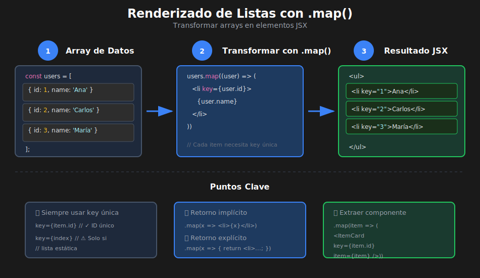

# Renderizado de Listas en React

## 🎯 Objetivos de Aprendizaje

- Renderizar arrays de datos con `.map()`
- Tipar arrays y sus elementos correctamente
- Extraer componentes de lista e ítem
- Manejar listas vacías y estados por defecto
- Aplicar patrones para listas complejas

---

## 📊 Diagrama: Renderizado de Listas



---

## 📋 ¿Por qué `.map()` en JSX?

En React, usamos el método `.map()` de arrays para transformar datos en elementos JSX.

```tsx
// QUÉ: Concepto básico de renderizado de listas
// PARA: Transformar un array de datos en elementos visuales
// IMPACTO: Patrón fundamental para mostrar colecciones de datos

import React from 'react';

const FruitList: React.FC = () => {
  const fruits: string[] = ['🍎 Manzana', '🍌 Banana', '🍊 Naranja'];

  return (
    <ul>
      {fruits.map((fruit, index) => (
        <li key={index}>{fruit}</li>
      ))}
    </ul>
  );
};

// Resultado:
// • 🍎 Manzana
// • 🍌 Banana
// • 🍊 Naranja
```

**¿Por qué `.map()` y no `for` loops?**

```tsx
// ❌ NO FUNCIONA: for loops no retornan JSX directamente
const BadExample: React.FC = () => {
  const items = ['a', 'b', 'c'];

  return (
    <ul>
      {/* for no se puede usar aquí */}
      {for (const item of items) {
        <li>{item}</li>  // Error!
      }}
    </ul>
  );
};

// ✅ FUNCIONA: .map() retorna un array de elementos
const GoodExample: React.FC = () => {
  const items = ['a', 'b', 'c'];

  return (
    <ul>
      {items.map((item) => (
        <li key={item}>{item}</li>
      ))}
    </ul>
  );
};
```

---

## 1️⃣ Listas con Tipos Básicos

### Array de Strings

```tsx
// QUÉ: Renderizar array de strings
// PARA: Caso más simple de lista
// IMPACTO: Base para entender el patrón

import React from 'react';

const TagList: React.FC = () => {
  const tags: string[] = ['React', 'TypeScript', 'Vite', 'CSS'];

  return (
    <div className="tags">
      {tags.map((tag) => (
        <span
          key={tag}
          className="tag">
          #{tag}
        </span>
      ))}
    </div>
  );
};
```

### Array de Números

```tsx
// QUÉ: Renderizar array de números
// PARA: Mostrar datos numéricos en lista
// IMPACTO: Formateo de números en UI

import React from 'react';

interface PricesProps {
  prices: number[];
}

const PriceList: React.FC<PricesProps> = ({ prices }) => {
  return (
    <ul className="prices">
      {prices.map((price, index) => (
        <li key={index}>${price.toFixed(2)}</li>
      ))}
    </ul>
  );
};

// Uso
<PriceList prices={[9.99, 19.99, 29.99, 49.99]} />;
```

---

## 2️⃣ Listas con Objetos

### Interface para Elementos

```tsx
// QUÉ: Definir interface para elementos de lista
// PARA: Tipar objetos que se renderizarán
// IMPACTO: Autocompletado, validación de tipos, documentación

// types/index.ts
export interface User {
  id: number;
  name: string;
  email: string;
  avatar?: string;
  role: 'admin' | 'user' | 'guest';
}

export interface Product {
  id: string;
  name: string;
  price: number;
  category: string;
  inStock: boolean;
}

export interface Task {
  id: number;
  title: string;
  completed: boolean;
  priority: 'low' | 'medium' | 'high';
  dueDate?: string;
}
```

### Renderizar Lista de Objetos

```tsx
// QUÉ: Renderizar array de objetos User
// PARA: Mostrar lista de usuarios con sus propiedades
// IMPACTO: Patrón común en aplicaciones reales

import React from 'react';

interface User {
  id: number;
  name: string;
  email: string;
  role: 'admin' | 'user';
}

interface UserListProps {
  users: User[];
}

const UserList: React.FC<UserListProps> = ({ users }) => {
  return (
    <ul className="user-list">
      {users.map((user) => (
        <li
          key={user.id}
          className="user-item">
          <strong>{user.name}</strong>
          <span>{user.email}</span>
          <span className={`badge badge-${user.role}`}>{user.role}</span>
        </li>
      ))}
    </ul>
  );
};

// Uso
const users: User[] = [
  { id: 1, name: 'Ana García', email: 'ana@email.com', role: 'admin' },
  { id: 2, name: 'Carlos López', email: 'carlos@email.com', role: 'user' },
  { id: 3, name: 'María Rodríguez', email: 'maria@email.com', role: 'user' },
];

<UserList users={users} />;
```

---

## 3️⃣ Extraer Componente de Ítem

**Mejor práctica**: Separar el componente de lista del componente de ítem.

```tsx
// QUÉ: Componente separado para cada ítem
// PARA: Mejor organización, reutilización, testeo
// IMPACTO: Código más mantenible y componentes más pequeños

import React from 'react';

// ============================================
// TYPES
// ============================================
interface Product {
  id: string;
  name: string;
  price: number;
  category: string;
  image?: string;
}

// ============================================
// COMPONENTE: ProductCard (ítem individual)
// ============================================
interface ProductCardProps {
  product: Product;
  onSelect?: (id: string) => void;
}

const ProductCard: React.FC<ProductCardProps> = ({ product, onSelect }) => {
  // QUÉ: Maneja el click en el producto
  // PARA: Comunicar selección al componente padre
  // IMPACTO: Patrón de callback para comunicación hijo → padre
  const handleClick = (): void => {
    if (onSelect) {
      onSelect(product.id);
    }
  };

  return (
    <div
      className="product-card"
      onClick={handleClick}>
      {product.image && (
        
      )}
      <h3>{product.name}</h3>
      <p className="category">{product.category}</p>
      <p className="price">${product.price.toFixed(2)}</p>
    </div>
  );
};

// ============================================
// COMPONENTE: ProductList (lista completa)
// ============================================
interface ProductListProps {
  products: Product[];
  onProductSelect?: (id: string) => void;
}

const ProductList: React.FC<ProductListProps> = ({
  products,
  onProductSelect,
}) => {
  return (
    <div className="product-list">
      {products.map((product) => (
        <ProductCard
          key={product.id}
          product={product}
          onSelect={onProductSelect}
        />
      ))}
    </div>
  );
};

export { ProductCard, ProductList };
```

---

## 4️⃣ Manejar Listas Vacías

**Siempre** maneja el caso de lista vacía:

```tsx
// QUÉ: Manejo de estado vacío en listas
// PARA: Mejor UX cuando no hay datos
// IMPACTO: El usuario sabe que no hay datos (vs pensar que está cargando)

import React from 'react';

interface Task {
  id: number;
  title: string;
  completed: boolean;
}

interface TaskListProps {
  tasks: Task[];
}

const TaskList: React.FC<TaskListProps> = ({ tasks }) => {
  // Manejar lista vacía
  if (tasks.length === 0) {
    return (
      <div className="empty-state">
        <span className="icon">📋</span>
        <p>No hay tareas pendientes</p>
        <p className="hint">¡Agrega una tarea para comenzar!</p>
      </div>
    );
  }

  return (
    <ul className="task-list">
      {tasks.map((task) => (
        <li
          key={task.id}
          className={task.completed ? 'completed' : ''}>
          <input
            type="checkbox"
            checked={task.completed}
            readOnly
          />
          <span>{task.title}</span>
        </li>
      ))}
    </ul>
  );
};
```

### Componente EmptyState Reutilizable

```tsx
// QUÉ: Componente genérico para estados vacíos
// PARA: Reutilizar en diferentes listas
// IMPACTO: Consistencia visual y menos código repetido

import React from 'react';

interface EmptyStateProps {
  icon?: string;
  title: string;
  description?: string;
  action?: {
    label: string;
    onClick: () => void;
  };
}

const EmptyState: React.FC<EmptyStateProps> = ({
  icon = '📭',
  title,
  description,
  action,
}) => {
  return (
    <div className="empty-state">
      <span className="empty-icon">{icon}</span>
      <h3>{title}</h3>
      {description && <p>{description}</p>}
      {action && (
        <button onClick={action.onClick}>
          {action.label}
        </button>
      )}
    </div>
  );
};

// Uso en diferentes contextos
<EmptyState
  icon="🔍"
  title="Sin resultados"
  description="Intenta con otros términos de búsqueda"
/>

<EmptyState
  icon="🛒"
  title="Carrito vacío"
  description="Agrega productos para comenzar"
  action={{
    label: 'Ver productos',
    onClick: () => navigate('/products'),
  }}
/>
```

---

## 5️⃣ Listas con Estados de Carga y Error

```tsx
// QUÉ: Lista con manejo completo de estados
// PARA: Mostrar loading, error y datos
// IMPACTO: UX profesional con feedback visual

import React, { useState, useEffect } from 'react';

interface User {
  id: number;
  name: string;
  email: string;
}

const UserDirectory: React.FC = () => {
  const [users, setUsers] = useState<User[]>([]);
  const [loading, setLoading] = useState<boolean>(true);
  const [error, setError] = useState<string | null>(null);

  useEffect(() => {
    const fetchUsers = async (): Promise<void> => {
      try {
        setLoading(true);
        setError(null);

        const response = await fetch(
          'https://jsonplaceholder.typicode.com/users',
        );
        if (!response.ok) {
          throw new Error('Error al cargar usuarios');
        }

        const data: User[] = await response.json();
        setUsers(data);
      } catch (err) {
        setError(err instanceof Error ? err.message : 'Error desconocido');
      } finally {
        setLoading(false);
      }
    };

    fetchUsers();
  }, []);

  // Estado: Cargando
  if (loading) {
    return (
      <div className="loading">
        <div className="spinner">⏳</div>
        <p>Cargando usuarios...</p>
      </div>
    );
  }

  // Estado: Error
  if (error) {
    return (
      <div className="error">
        <span>❌</span>
        <p>Error: {error}</p>
        <button onClick={() => window.location.reload()}>Reintentar</button>
      </div>
    );
  }

  // Estado: Sin datos
  if (users.length === 0) {
    return (
      <div className="empty">
        <span>👥</span>
        <p>No hay usuarios registrados</p>
      </div>
    );
  }

  // Estado: Datos cargados
  return (
    <div className="user-directory">
      <h2>Directorio de Usuarios ({users.length})</h2>
      <ul>
        {users.map((user) => (
          <li key={user.id}>
            <strong>{user.name}</strong>
            <span>{user.email}</span>
          </li>
        ))}
      </ul>
    </div>
  );
};
```

---

## 6️⃣ Listas Anidadas

```tsx
// QUÉ: Renderizar listas dentro de listas
// PARA: Datos jerárquicos (categorías con productos, etc.)
// IMPACTO: Estructuras de datos complejas en UI

import React from 'react';

interface MenuItem {
  id: number;
  name: string;
  price: number;
}

interface MenuCategory {
  id: number;
  name: string;
  items: MenuItem[];
}

interface RestaurantMenuProps {
  categories: MenuCategory[];
}

const RestaurantMenu: React.FC<RestaurantMenuProps> = ({ categories }) => {
  return (
    <div className="menu">
      {categories.map((category) => (
        <section
          key={category.id}
          className="category">
          <h2>{category.name}</h2>

          {category.items.length === 0 ? (
            <p className="no-items">Sin productos en esta categoría</p>
          ) : (
            <ul className="items">
              {category.items.map((item) => (
                <li
                  key={item.id}
                  className="menu-item">
                  <span className="name">{item.name}</span>
                  <span className="price">${item.price.toFixed(2)}</span>
                </li>
              ))}
            </ul>
          )}
        </section>
      ))}
    </div>
  );
};

// Datos de ejemplo
const menuData: MenuCategory[] = [
  {
    id: 1,
    name: '🍕 Pizzas',
    items: [
      { id: 101, name: 'Margherita', price: 12.99 },
      { id: 102, name: 'Pepperoni', price: 14.99 },
    ],
  },
  {
    id: 2,
    name: '🍔 Hamburguesas',
    items: [
      { id: 201, name: 'Clásica', price: 9.99 },
      { id: 202, name: 'BBQ', price: 11.99 },
    ],
  },
  {
    id: 3,
    name: '🥗 Ensaladas',
    items: [], // Categoría vacía
  },
];
```

---

## 7️⃣ Patrones Avanzados

### Lista con Selección

```tsx
// QUÉ: Lista con elementos seleccionables
// PARA: Permitir selección única o múltiple
// IMPACTO: Interactividad avanzada en listas

import React, { useState } from 'react';

interface Option {
  id: string;
  label: string;
}

interface SelectableListProps {
  options: Option[];
  multiple?: boolean;
  onChange: (selected: string[]) => void;
}

const SelectableList: React.FC<SelectableListProps> = ({
  options,
  multiple = false,
  onChange,
}) => {
  const [selected, setSelected] = useState<string[]>([]);

  const handleSelect = (id: string): void => {
    let newSelected: string[];

    if (multiple) {
      // Selección múltiple: toggle
      newSelected = selected.includes(id)
        ? selected.filter((s) => s !== id)
        : [...selected, id];
    } else {
      // Selección única
      newSelected = selected.includes(id) ? [] : [id];
    }

    setSelected(newSelected);
    onChange(newSelected);
  };

  return (
    <ul className="selectable-list">
      {options.map((option) => (
        <li
          key={option.id}
          className={selected.includes(option.id) ? 'selected' : ''}
          onClick={() => handleSelect(option.id)}>
          <span className="checkbox">
            {selected.includes(option.id) ? '✅' : '⬜'}
          </span>
          {option.label}
        </li>
      ))}
    </ul>
  );
};
```

### Lista con Acciones

```tsx
// QUÉ: Lista con botones de acción por ítem
// PARA: CRUD operations en cada elemento
// IMPACTO: Patrón común en apps de gestión

import React from 'react';

interface Item {
  id: number;
  name: string;
}

interface ActionableListProps {
  items: Item[];
  onEdit: (id: number) => void;
  onDelete: (id: number) => void;
}

const ActionableList: React.FC<ActionableListProps> = ({
  items,
  onEdit,
  onDelete,
}) => {
  return (
    <ul className="actionable-list">
      {items.map((item) => (
        <li key={item.id}>
          <span className="name">{item.name}</span>
          <div className="actions">
            <button
              onClick={() => onEdit(item.id)}
              className="btn-edit"
              aria-label={`Editar ${item.name}`}>
              ✏️
            </button>
            <button
              onClick={() => onDelete(item.id)}
              className="btn-delete"
              aria-label={`Eliminar ${item.name}`}>
              🗑️
            </button>
          </div>
        </li>
      ))}
    </ul>
  );
};
```

---

## ✅ Resumen de Mejores Prácticas

| Práctica                       | Descripción                                         |
| ------------------------------ | --------------------------------------------------- |
| **Usar `.map()`**              | Única forma idiomática de renderizar listas en JSX  |
| **Tipar arrays**               | `User[]`, `Product[]`, etc. para autocompletado     |
| **Extraer componente de ítem** | `ProductCard` separado de `ProductList`             |
| **Manejar lista vacía**        | Siempre mostrar estado vacío con mensaje útil       |
| **Keys únicas**                | Usar `id` del dato, no `index` (ver siguiente tema) |
| **Estados de carga**           | Loading, error, empty, data                         |

---

## ⚠️ Errores Comunes

```tsx
// ❌ ERROR 1: Olvidar la key
{
  items.map((item) => (
    <li>{item.name}</li> // Warning: Each child should have a unique key
  ));
}

// ✅ CORRECCIÓN
{
  items.map((item) => <li key={item.id}>{item.name}</li>);
}

// ❌ ERROR 2: Retorno implícito olvidado
{
  items.map((item) => {
    <li key={item.id}>{item.name}</li>; // No retorna nada!
  });
}

// ✅ CORRECCIÓN: Agregar return o usar paréntesis
{
  items.map((item) => <li key={item.id}>{item.name}</li>);
}

// ❌ ERROR 3: No manejar lista vacía
const List = ({ items }) => (
  <ul>
    {items.map((item) => (
      <li key={item.id}>{item.name}</li>
    ))}
  </ul>
);
// Si items = [], renderiza <ul></ul> vacío

// ✅ CORRECCIÓN
const List = ({ items }) => {
  if (items.length === 0) {
    return <p>No hay elementos</p>;
  }
  return (
    <ul>
      {items.map((item) => (
        <li key={item.id}>{item.name}</li>
      ))}
    </ul>
  );
};
```

---

## 📚 Recursos Adicionales

- [React Docs: Rendering Lists](https://react.dev/learn/rendering-lists)
- [TypeScript: Arrays](https://www.typescriptlang.org/docs/handbook/2/everyday-types.html#arrays)

---

_Siguiente: [03 - Keys y Optimización](./03-keys-optimizacion.md)_
