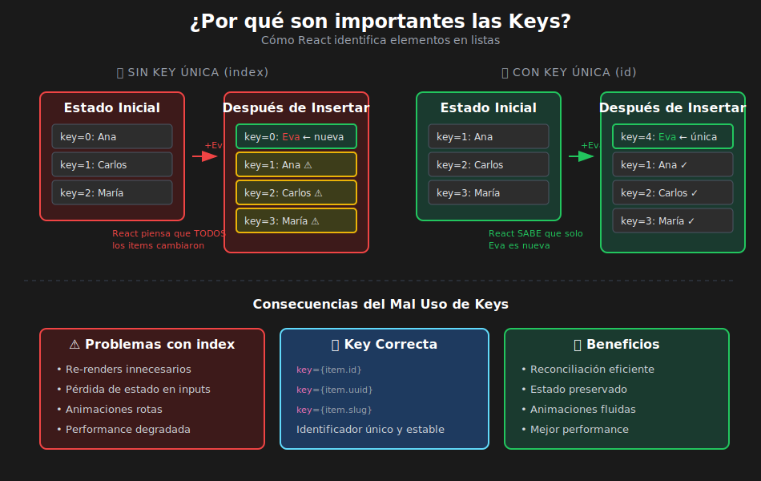

# Keys y Optimización en Listas

## 🎯 Objetivos de Aprendizaje

- Comprender por qué React necesita keys
- Entender el algoritmo de reconciliación (diffing)
- Saber cuándo usar `id` vs `index` como key
- Identificar problemas causados por keys incorrectas
- Generar keys únicas correctamente

---

## 📊 Diagrama: Importancia de las Keys



---

## 📋 ¿Por qué React Necesita Keys?

Las **keys** ayudan a React a identificar qué elementos han cambiado, agregado o eliminado en una lista.

```tsx
// QUÉ: Ejemplo básico de keys en lista
// PARA: React identifica cada elemento de forma única
// IMPACTO: Optimiza actualizaciones, evita re-renderizados innecesarios

import React from 'react';

interface Todo {
  id: number;
  text: string;
}

const TodoList: React.FC<{ todos: Todo[] }> = ({ todos }) => {
  return (
    <ul>
      {todos.map((todo) => (
        // ✅ Key única basada en el id del dato
        <li key={todo.id}>{todo.text}</li>
      ))}
    </ul>
  );
};
```

---

## 1️⃣ El Algoritmo de Reconciliación

Cuando el estado cambia, React compara el Virtual DOM anterior con el nuevo (proceso llamado **diffing**).

### Sin Keys

```tsx
// QUÉ: Comportamiento sin keys (o con index)
// PARA: Entender por qué React necesita identificadores
// IMPACTO: Sin keys, React no puede optimizar actualizaciones

// Estado inicial
<ul>
  <li>Manzana</li>
  <li>Banana</li>
  <li>Cereza</li>
</ul>

// Después de insertar "Durazno" al inicio
<ul>
  <li>Durazno</li>  // React piensa: "Manzana" cambió a "Durazno"
  <li>Manzana</li>  // React piensa: "Banana" cambió a "Manzana"
  <li>Banana</li>   // React piensa: "Cereza" cambió a "Banana"
  <li>Cereza</li>   // React: Este es nuevo
</ul>

// ❌ PROBLEMA: React actualiza TODOS los elementos innecesariamente
```

### Con Keys

```tsx
// QUÉ: Comportamiento con keys correctas
// PARA: React identifica cada elemento de forma única
// IMPACTO: Solo se actualiza lo que realmente cambió

// Estado inicial
<ul>
  <li key="apple">Manzana</li>
  <li key="banana">Banana</li>
  <li key="cherry">Cereza</li>
</ul>

// Después de insertar "Durazno" al inicio
<ul>
  <li key="peach">Durazno</li>   // React: Este es nuevo, lo inserto
  <li key="apple">Manzana</li>   // React: Ya existe, no toco
  <li key="banana">Banana</li>   // React: Ya existe, no toco
  <li key="cherry">Cereza</li>   // React: Ya existe, no toco
</ul>

// ✅ CORRECTO: React solo inserta el nuevo elemento
```

---

## 2️⃣ Index como Key: Cuándo Sí y Cuándo No

### ❌ NO usar index cuando la lista puede cambiar

```tsx
// QUÉ: Problema de usar index como key en lista modificable
// PARA: Entender cuándo index causa bugs
// IMPACTO: Estado de inputs se pierde al reordenar/eliminar

import React, { useState } from 'react';

interface Item {
  id: number;
  name: string;
}

// ❌ MAL: Index como key en lista que se modifica
const BadExample: React.FC = () => {
  const [items, setItems] = useState<Item[]>([
    { id: 1, name: 'Primero' },
    { id: 2, name: 'Segundo' },
    { id: 3, name: 'Tercero' },
  ]);

  const removeFirst = (): void => {
    setItems(items.slice(1)); // Elimina el primer elemento
  };

  return (
    <div>
      <button onClick={removeFirst}>Eliminar primero</button>
      <ul>
        {items.map((item, index) => (
          // ❌ Usando index como key
          <li key={index}>
            <input defaultValue={item.name} />
          </li>
        ))}
      </ul>
    </div>
  );
};

// PROBLEMA:
// Antes: [0: "Primero", 1: "Segundo", 2: "Tercero"]
// Después de eliminar: [0: "Segundo", 1: "Tercero"]
//
// React piensa:
// - key=0 sigue existiendo → mantiene el input (pero ahora tiene datos de "Segundo")
// - key=1 sigue existiendo → mantiene el input (pero ahora tiene datos de "Tercero")
// - key=2 ya no existe → lo elimina
//
// ¡El input del primer elemento mantiene el valor "Primero" aunque el dato cambió!
```

```tsx
// ✅ BIEN: ID único como key
const GoodExample: React.FC = () => {
  const [items, setItems] = useState<Item[]>([
    { id: 1, name: 'Primero' },
    { id: 2, name: 'Segundo' },
    { id: 3, name: 'Tercero' },
  ]);

  const removeFirst = (): void => {
    setItems(items.slice(1));
  };

  return (
    <div>
      <button onClick={removeFirst}>Eliminar primero</button>
      <ul>
        {items.map((item) => (
          // ✅ Usando id único como key
          <li key={item.id}>
            <input defaultValue={item.name} />
          </li>
        ))}
      </ul>
    </div>
  );
};

// CORRECTO:
// Antes: [id=1: "Primero", id=2: "Segundo", id=3: "Tercero"]
// Después: [id=2: "Segundo", id=3: "Tercero"]
//
// React:
// - key=1 ya no existe → lo elimina correctamente
// - key=2 sigue existiendo → mantiene el input con "Segundo"
// - key=3 sigue existiendo → mantiene el input con "Tercero"
```

### ✅ SÍ usar index cuando la lista es estática

```tsx
// QUÉ: Casos donde index como key es aceptable
// PARA: Saber cuándo no importa usar index
// IMPACTO: Simplifica código cuando no hay modificaciones

import React from 'react';

// ✅ OK: Lista estática que nunca cambia
const NavigationMenu: React.FC = () => {
  const menuItems = ['Inicio', 'Productos', 'Contacto', 'Acerca de'];

  return (
    <nav>
      <ul>
        {menuItems.map((item, index) => (
          // Index es OK porque la lista nunca cambia
          <li key={index}>{item}</li>
        ))}
      </ul>
    </nav>
  );
};

// ✅ OK: Lista solo se renderiza una vez
const StaticBreadcrumb: React.FC<{ paths: string[] }> = ({ paths }) => {
  return (
    <nav className="breadcrumb">
      {paths.map((path, index) => (
        <span key={index}>
          {path}
          {index < paths.length - 1 && ' > '}
        </span>
      ))}
    </nav>
  );
};
```

### 📋 Regla de Oro

| Situación                         | ¿Usar index? | Recomendación       |
| --------------------------------- | ------------ | ------------------- |
| Lista estática (menú, tabs)       | ✅ OK        | Index es suficiente |
| Lista se puede reordenar          | ❌ NO        | Usar ID único       |
| Se pueden agregar elementos       | ❌ NO        | Usar ID único       |
| Se pueden eliminar elementos      | ❌ NO        | Usar ID único       |
| Lista tiene inputs/estado interno | ❌ NO        | Usar ID único       |

---

## 3️⃣ Generar Keys Únicas

### Usar ID del Dato

```tsx
// QUÉ: Usar ID existente en los datos
// PARA: La mejor opción cuando el dato tiene ID
// IMPACTO: Keys estables y únicas por naturaleza

interface User {
  id: number; // ← Usar esto como key
  uuid: string; // ← O esto si está disponible
  name: string;
}

const UserList: React.FC<{ users: User[] }> = ({ users }) => (
  <ul>
    {users.map((user) => (
      <li key={user.id}>{user.name}</li>
    ))}
  </ul>
);
```

### Generar ID al Crear Datos

```tsx
// QUÉ: Generar ID único al crear nuevos elementos
// PARA: Datos que no vienen de una base de datos
// IMPACTO: Cada elemento tiene ID desde su creación

import React, { useState } from 'react';

interface Todo {
  id: string;
  text: string;
  completed: boolean;
}

// Función para generar ID único
const generateId = (): string => {
  return `${Date.now()}-${Math.random().toString(36).substr(2, 9)}`;
};

const TodoApp: React.FC = () => {
  const [todos, setTodos] = useState<Todo[]>([]);
  const [input, setInput] = useState<string>('');

  const addTodo = (): void => {
    if (!input.trim()) return;

    const newTodo: Todo = {
      id: generateId(), // ← ID generado al crear
      text: input,
      completed: false,
    };

    setTodos([...todos, newTodo]);
    setInput('');
  };

  return (
    <div>
      <input
        value={input}
        onChange={(e) => setInput(e.target.value)}
      />
      <button onClick={addTodo}>Agregar</button>

      <ul>
        {todos.map((todo) => (
          <li key={todo.id}>{todo.text}</li>
        ))}
      </ul>
    </div>
  );
};
```

### Usar crypto.randomUUID()

```tsx
// QUÉ: Usar API nativa para UUID
// PARA: Generar UUIDs estándar (v4)
// IMPACTO: Garantiza unicidad global

const generateUUID = (): string => {
  // Disponible en navegadores modernos
  return crypto.randomUUID();
};

// Ejemplo: "550e8400-e29b-41d4-a716-446655440000"
```

### Combinar Campos Únicos

```tsx
// QUÉ: Crear key combinando campos que juntos son únicos
// PARA: Cuando no hay un ID único pero la combinación sí lo es
// IMPACTO: Keys únicas basadas en datos existentes

interface ScheduleSlot {
  day: string;
  hour: number;
  room: string;
}

const Schedule: React.FC<{ slots: ScheduleSlot[] }> = ({ slots }) => (
  <table>
    <tbody>
      {slots.map((slot) => (
        // Combinación única: día + hora + sala
        <tr key={`${slot.day}-${slot.hour}-${slot.room}`}>
          <td>{slot.day}</td>
          <td>{slot.hour}:00</td>
          <td>{slot.room}</td>
        </tr>
      ))}
    </tbody>
  </table>
);
```

---

## 4️⃣ Problemas Comunes con Keys

### Problema 1: Keys Duplicadas

```tsx
// ❌ ERROR: Keys duplicadas
const data = [
  { id: 1, name: 'A' },
  { id: 1, name: 'B' }, // ¡Mismo ID!
  { id: 2, name: 'C' },
];

// React mostrará warning:
// "Encountered two children with the same key"

// ✅ SOLUCIÓN: Asegurar IDs únicos en los datos
// O usar index si es inevitable
const dataFixed = data.map((item, index) => ({
  ...item,
  uniqueKey: `${item.id}-${index}`,
}));
```

### Problema 2: Keys que Cambian en Cada Render

```tsx
// ❌ MAL: Generar key en cada render
const BadList: React.FC<{ items: string[] }> = ({ items }) => (
  <ul>
    {items.map((item) => (
      // ¡Se genera nuevo UUID en cada render!
      <li key={crypto.randomUUID()}>{item}</li>
    ))}
  </ul>
);

// Problema: Cada render crea nuevas keys
// → React destruye y recrea TODOS los elementos
// → Pérdida de estado, mal rendimiento

// ✅ BIEN: Keys estables
const GoodList: React.FC<{ items: Array<{ id: string; text: string }> }> = ({
  items,
}) => (
  <ul>
    {items.map((item) => (
      <li key={item.id}>{item.text}</li>
    ))}
  </ul>
);
```

### Problema 3: Componentes con Estado Interno

```tsx
// QUÉ: Demostrar problema de keys con estado interno
// PARA: Entender impacto en componentes controlados
// IMPACTO: Estado se pierde o se mezcla con keys incorrectas

import React, { useState } from 'react';

interface Item {
  id: number;
  name: string;
}

// Componente hijo con estado interno
const EditableItem: React.FC<{ name: string }> = ({ name }) => {
  const [isEditing, setIsEditing] = useState<boolean>(false);
  const [value, setValue] = useState<string>(name);

  if (isEditing) {
    return (
      <input
        value={value}
        onChange={(e) => setValue(e.target.value)}
        onBlur={() => setIsEditing(false)}
        autoFocus
      />
    );
  }

  return <span onClick={() => setIsEditing(true)}>{value} ✏️</span>;
};

// ❌ MAL: Con index, el estado se confunde al reordenar
const BadParent: React.FC = () => {
  const [items, setItems] = useState<Item[]>([
    { id: 1, name: 'Primero' },
    { id: 2, name: 'Segundo' },
  ]);

  const reverse = (): void => {
    setItems([...items].reverse());
  };

  return (
    <div>
      <button onClick={reverse}>Invertir orden</button>
      <ul>
        {items.map((item, index) => (
          <li key={index}>
            {' '}
            {/* ❌ Index como key */}
            <EditableItem name={item.name} />
          </li>
        ))}
      </ul>
    </div>
  );
};
// Al invertir, el estado de EditableItem se queda en la misma posición

// ✅ BIEN: Con ID, el estado sigue al elemento
const GoodParent: React.FC = () => {
  const [items, setItems] = useState<Item[]>([
    { id: 1, name: 'Primero' },
    { id: 2, name: 'Segundo' },
  ]);

  const reverse = (): void => {
    setItems([...items].reverse());
  };

  return (
    <div>
      <button onClick={reverse}>Invertir orden</button>
      <ul>
        {items.map((item) => (
          <li key={item.id}>
            {' '}
            {/* ✅ ID como key */}
            <EditableItem name={item.name} />
          </li>
        ))}
      </ul>
    </div>
  );
};
// Al invertir, el estado de EditableItem sigue al elemento correcto
```

---

## 5️⃣ Keys en Fragmentos y Componentes

### Keys en React.Fragment

```tsx
// QUÉ: Usar key con Fragment explícito
// PARA: Cuando necesitas key pero no wrapper HTML
// IMPACTO: Permite keys sin agregar nodos extra al DOM

import React from 'react';

interface Definition {
  id: number;
  term: string;
  description: string;
}

const Glossary: React.FC<{ definitions: Definition[] }> = ({ definitions }) => (
  <dl>
    {definitions.map((def) => (
      // No puedes usar <> (shorthand) con key
      // Debes usar React.Fragment explícito
      <React.Fragment key={def.id}>
        <dt>{def.term}</dt>
        <dd>{def.description}</dd>
      </React.Fragment>
    ))}
  </dl>
);

// Resultado HTML (sin wrappers innecesarios):
// <dl>
//   <dt>React</dt>
//   <dd>Biblioteca de UI</dd>
//   <dt>TypeScript</dt>
//   <dd>JavaScript con tipos</dd>
// </dl>
```

### Keys en Componentes Custom

```tsx
// QUÉ: Keys se pasan al componente, no se reciben como prop
// PARA: Entender que key es especial y no accesible en el hijo
// IMPACTO: key es solo para React, no para tu lógica

interface CardProps {
  title: string;
  // key NO está aquí - es especial
}

const Card: React.FC<CardProps> = ({ title }) => {
  // ❌ NO PUEDES acceder a key como prop
  // console.log(props.key);  // undefined

  return <div className="card">{title}</div>;
};

// Si necesitas el ID en el hijo, pásalo como otra prop
interface CardWithIdProps {
  id: number;
  title: string;
}

const CardWithId: React.FC<CardWithIdProps> = ({ id, title }) => {
  return (
    <div
      className="card"
      data-id={id}>
      {title}
    </div>
  );
};

// Uso
<CardWithId
  key={item.id}
  id={item.id}
  title={item.title}
/>;
```

---

## ✅ Resumen: Mejores Prácticas con Keys

| Práctica                             | Descripción                                    |
| ------------------------------------ | ---------------------------------------------- |
| **Usar ID del dato**                 | Primera opción: `key={item.id}`                |
| **Generar ID al crear**              | `id: generateId()` al agregar elementos        |
| **Keys estables**                    | No generar en render: `key={Math.random()}` ❌ |
| **Evitar index en listas dinámicas** | Solo OK para listas estáticas                  |
| **Keys únicas entre hermanos**       | No necesitan ser globalmente únicas            |
| **No acceder a key como prop**       | `key` es solo para React                       |

---

## ⚠️ Checklist de Debugging

Si tienes problemas con listas, verifica:

- [ ] ¿Cada elemento tiene key única?
- [ ] ¿Las keys son estables (no cambian en cada render)?
- [ ] ¿Estás usando index en lista que se modifica?
- [ ] ¿Los componentes hijos tienen estado interno?
- [ ] ¿Las keys están duplicadas en los datos?
- [ ] ¿Recibes warnings en consola sobre keys?

---

## 📚 Recursos Adicionales

- [React Docs: Keeping list items in order with key](https://react.dev/learn/rendering-lists#keeping-list-items-in-order-with-key)
- [React Docs: Rules of keys](https://react.dev/learn/rendering-lists#rules-of-keys)
- [Why React needs keys](https://react.dev/learn/rendering-lists#why-does-react-need-keys)

---

_Siguiente: [04 - Filtrado, Ordenamiento y Búsqueda](./04-filtrado-ordenamiento-busqueda.md)_
