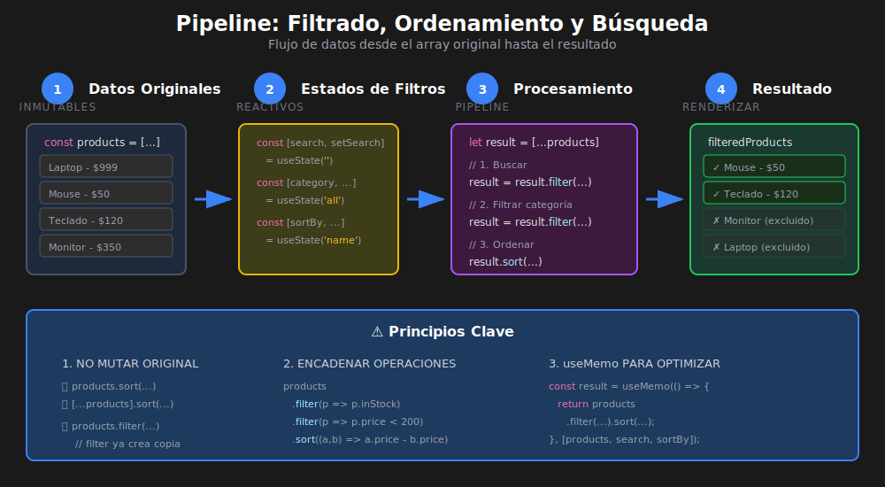

# Filtrado, Ordenamiento y Búsqueda

## 🎯 Objetivos de Aprendizaje

- Filtrar datos con `.filter()` en React
- Ordenar listas con `.sort()` sin mutar el original
- Implementar búsqueda en tiempo real
- Combinar múltiples filtros
- Aplicar debounce para optimizar búsqueda

---

## 📊 Diagrama: Flujo de Filtrado y Ordenamiento



---

## 📋 Principio Fundamental: No Mutar el Estado

En React, **nunca modificamos el estado directamente**. Siempre creamos copias.

```tsx
// ❌ MAL: Mutar el array original
items.sort((a, b) => a.name.localeCompare(b.name));

// ✅ BIEN: Crear copia antes de modificar
[...items].sort((a, b) => a.name.localeCompare(b.name));

// ❌ MAL: Modificar objeto en array
items[0].name = 'Nuevo nombre';

// ✅ BIEN: Crear nuevo array con objeto modificado
items.map((item, index) =>
  index === 0 ? { ...item, name: 'Nuevo nombre' } : item,
);
```

---

## 1️⃣ Filtrado con `.filter()`

### Filtro Básico

```tsx
// QUÉ: Filtrar array basado en condición
// PARA: Mostrar solo elementos que cumplen criterio
// IMPACTO: Lista se actualiza reactivamente al cambiar filtro

import React, { useState } from 'react';

interface Product {
  id: number;
  name: string;
  category: 'electronics' | 'clothing' | 'food';
  price: number;
  inStock: boolean;
}

const ProductFilter: React.FC = () => {
  const [products] = useState<Product[]>([
    {
      id: 1,
      name: 'Laptop',
      category: 'electronics',
      price: 999,
      inStock: true,
    },
    { id: 2, name: 'Camiseta', category: 'clothing', price: 25, inStock: true },
    { id: 3, name: 'Manzanas', category: 'food', price: 5, inStock: false },
    {
      id: 4,
      name: 'Teléfono',
      category: 'electronics',
      price: 699,
      inStock: true,
    },
    {
      id: 5,
      name: 'Pantalón',
      category: 'clothing',
      price: 50,
      inStock: false,
    },
  ]);

  const [showOnlyInStock, setShowOnlyInStock] = useState<boolean>(false);

  // QUÉ: Filtrar productos según estado del checkbox
  // PARA: Mostrar solo productos en stock cuando está activo
  // IMPACTO: La lista se recalcula en cada render cuando cambia el filtro
  const filteredProducts = showOnlyInStock
    ? products.filter((product) => product.inStock)
    : products;

  return (
    <div>
      <label>
        <input
          type="checkbox"
          checked={showOnlyInStock}
          onChange={(e) => setShowOnlyInStock(e.target.checked)}
        />
        Solo mostrar productos en stock
      </label>

      <ul>
        {filteredProducts.map((product) => (
          <li key={product.id}>
            {product.name} - ${product.price}
            {!product.inStock && <span> (Agotado)</span>}
          </li>
        ))}
      </ul>

      <p>
        Mostrando {filteredProducts.length} de {products.length} productos
      </p>
    </div>
  );
};
```

### Filtro por Categoría

```tsx
// QUÉ: Filtrar por categoría seleccionada
// PARA: Permitir al usuario elegir qué categoría ver
// IMPACTO: Patrón común en catálogos y e-commerce

import React, { useState } from 'react';

type Category = 'all' | 'electronics' | 'clothing' | 'food';

interface Product {
  id: number;
  name: string;
  category: Exclude<Category, 'all'>;
  price: number;
}

const CategoryFilter: React.FC = () => {
  const [products] = useState<Product[]>([
    { id: 1, name: 'Laptop', category: 'electronics', price: 999 },
    { id: 2, name: 'Camiseta', category: 'clothing', price: 25 },
    { id: 3, name: 'Manzanas', category: 'food', price: 5 },
    { id: 4, name: 'Teléfono', category: 'electronics', price: 699 },
    { id: 5, name: 'Pantalón', category: 'clothing', price: 50 },
  ]);

  const [selectedCategory, setSelectedCategory] = useState<Category>('all');

  // QUÉ: Filtrar por categoría o mostrar todos
  // PARA: "all" muestra todo, otros valores filtran
  // IMPACTO: Flexible para múltiples opciones de filtro
  const filteredProducts =
    selectedCategory === 'all'
      ? products
      : products.filter((product) => product.category === selectedCategory);

  const categories: Category[] = ['all', 'electronics', 'clothing', 'food'];

  return (
    <div>
      <div className="filter-buttons">
        {categories.map((category) => (
          <button
            key={category}
            onClick={() => setSelectedCategory(category)}
            className={selectedCategory === category ? 'active' : ''}>
            {category === 'all' ? 'Todos' : category}
          </button>
        ))}
      </div>

      <ul>
        {filteredProducts.map((product) => (
          <li key={product.id}>
            {product.name} - ${product.price}
          </li>
        ))}
      </ul>
    </div>
  );
};
```

---

## 2️⃣ Ordenamiento con `.sort()`

### ⚠️ Importante: `.sort()` Muta el Array Original

```tsx
// ❌ MAL: sort() muta el array original
const sorted = products.sort((a, b) => a.price - b.price);
// products ahora está mutado también!

// ✅ BIEN: Crear copia primero
const sorted = [...products].sort((a, b) => a.price - b.price);
// products permanece intacto
```

### Ordenamiento Básico

```tsx
// QUÉ: Ordenar lista por diferentes criterios
// PARA: Permitir al usuario elegir orden de visualización
// IMPACTO: UX mejorada con opciones de ordenamiento

import React, { useState } from 'react';

interface Product {
  id: number;
  name: string;
  price: number;
  rating: number;
  createdAt: string;
}

type SortOption =
  | 'name-asc'
  | 'name-desc'
  | 'price-asc'
  | 'price-desc'
  | 'rating';

const SortableList: React.FC = () => {
  const [products] = useState<Product[]>([
    { id: 1, name: 'Laptop', price: 999, rating: 4.5, createdAt: '2024-01-15' },
    {
      id: 2,
      name: 'Auriculares',
      price: 150,
      rating: 4.8,
      createdAt: '2024-02-20',
    },
    { id: 3, name: 'Mouse', price: 50, rating: 4.2, createdAt: '2024-01-10' },
    {
      id: 4,
      name: 'Teclado',
      price: 120,
      rating: 4.6,
      createdAt: '2024-03-05',
    },
  ]);

  const [sortBy, setSortBy] = useState<SortOption>('name-asc');

  // QUÉ: Función de ordenamiento según opción seleccionada
  // PARA: Aplicar diferentes criterios de orden
  // IMPACTO: Lógica centralizada y mantenible
  const sortProducts = (items: Product[]): Product[] => {
    // Siempre crear copia antes de ordenar
    const sorted = [...items];

    switch (sortBy) {
      case 'name-asc':
        return sorted.sort((a, b) => a.name.localeCompare(b.name));
      case 'name-desc':
        return sorted.sort((a, b) => b.name.localeCompare(a.name));
      case 'price-asc':
        return sorted.sort((a, b) => a.price - b.price);
      case 'price-desc':
        return sorted.sort((a, b) => b.price - a.price);
      case 'rating':
        return sorted.sort((a, b) => b.rating - a.rating);
      default:
        return sorted;
    }
  };

  const sortedProducts = sortProducts(products);

  return (
    <div>
      <label>
        Ordenar por:
        <select
          value={sortBy}
          onChange={(e) => setSortBy(e.target.value as SortOption)}>
          <option value="name-asc">Nombre (A-Z)</option>
          <option value="name-desc">Nombre (Z-A)</option>
          <option value="price-asc">Precio (menor a mayor)</option>
          <option value="price-desc">Precio (mayor a menor)</option>
          <option value="rating">Mejor valorados</option>
        </select>
      </label>

      <ul>
        {sortedProducts.map((product) => (
          <li key={product.id}>
            {product.name} - ${product.price} - ⭐ {product.rating}
          </li>
        ))}
      </ul>
    </div>
  );
};
```

### Comparadores Comunes

```tsx
// QUÉ: Funciones de comparación para diferentes tipos
// PARA: Reutilizar lógica de ordenamiento
// IMPACTO: Código más limpio y mantenible

// Ordenar strings (alfabético)
const byNameAsc = (a: Product, b: Product): number =>
  a.name.localeCompare(b.name);

const byNameDesc = (a: Product, b: Product): number =>
  b.name.localeCompare(a.name);

// Ordenar números
const byPriceAsc = (a: Product, b: Product): number => a.price - b.price;

const byPriceDesc = (a: Product, b: Product): number => b.price - a.price;

// Ordenar fechas
const byDateAsc = (a: Product, b: Product): number =>
  new Date(a.createdAt).getTime() - new Date(b.createdAt).getTime();

const byDateDesc = (a: Product, b: Product): number =>
  new Date(b.createdAt).getTime() - new Date(a.createdAt).getTime();

// Ordenar booleanos (true primero)
const byInStockFirst = (a: Product, b: Product): number =>
  Number(b.inStock) - Number(a.inStock);

// Uso
const sorted = [...products].sort(byPriceAsc);
```

---

## 3️⃣ Búsqueda en Tiempo Real

### Búsqueda Básica

```tsx
// QUÉ: Filtrar lista mientras el usuario escribe
// PARA: Búsqueda instantánea sin botón de submit
// IMPACTO: UX fluida con feedback inmediato

import React, { useState } from 'react';

interface User {
  id: number;
  name: string;
  email: string;
  department: string;
}

const UserSearch: React.FC = () => {
  const [users] = useState<User[]>([
    { id: 1, name: 'Ana García', email: 'ana@email.com', department: 'Ventas' },
    {
      id: 2,
      name: 'Carlos López',
      email: 'carlos@email.com',
      department: 'TI',
    },
    {
      id: 3,
      name: 'María Rodríguez',
      email: 'maria@email.com',
      department: 'RRHH',
    },
    { id: 4, name: 'Juan Martínez', email: 'juan@email.com', department: 'TI' },
    {
      id: 5,
      name: 'Carmen Sánchez',
      email: 'carmen@email.com',
      department: 'Ventas',
    },
  ]);

  const [searchTerm, setSearchTerm] = useState<string>('');

  // QUÉ: Filtrar usuarios que coinciden con búsqueda
  // PARA: Buscar en nombre, email o departamento
  // IMPACTO: toLowerCase() hace la búsqueda case-insensitive
  const filteredUsers = users.filter((user) => {
    const term = searchTerm.toLowerCase();
    return (
      user.name.toLowerCase().includes(term) ||
      user.email.toLowerCase().includes(term) ||
      user.department.toLowerCase().includes(term)
    );
  });

  return (
    <div>
      <input
        type="text"
        placeholder="Buscar usuarios..."
        value={searchTerm}
        onChange={(e) => setSearchTerm(e.target.value)}
      />

      {filteredUsers.length === 0 ? (
        <p>No se encontraron usuarios para "{searchTerm}"</p>
      ) : (
        <ul>
          {filteredUsers.map((user) => (
            <li key={user.id}>
              <strong>{user.name}</strong>
              <span>{user.email}</span>
              <span className="badge">{user.department}</span>
            </li>
          ))}
        </ul>
      )}

      <p>
        {filteredUsers.length} de {users.length} usuarios
      </p>
    </div>
  );
};
```

### Búsqueda con Debounce

```tsx
// QUÉ: Retrasar búsqueda hasta que el usuario deje de escribir
// PARA: Optimizar rendimiento, evitar búsquedas en cada tecla
// IMPACTO: Menos renders, mejor rendimiento con datos grandes

import React, { useState, useEffect } from 'react';

// Hook personalizado para debounce
const useDebounce = <T,>(value: T, delay: number): T => {
  const [debouncedValue, setDebouncedValue] = useState<T>(value);

  useEffect(() => {
    // Configurar timer para actualizar después del delay
    const timer = setTimeout(() => {
      setDebouncedValue(value);
    }, delay);

    // Limpiar timer si value cambia antes del delay
    return () => {
      clearTimeout(timer);
    };
  }, [value, delay]);

  return debouncedValue;
};

// Componente con búsqueda debounced
interface Product {
  id: number;
  name: string;
  description: string;
}

const DebouncedSearch: React.FC = () => {
  const [products] = useState<Product[]>([
    { id: 1, name: 'Laptop', description: 'Computadora portátil' },
    { id: 2, name: 'Teléfono', description: 'Smartphone de última generación' },
    {
      id: 3,
      name: 'Tablet',
      description: 'Tableta para trabajo y entretenimiento',
    },
    // ... más productos
  ]);

  const [searchTerm, setSearchTerm] = useState<string>('');

  // Debounce de 300ms
  const debouncedSearchTerm = useDebounce(searchTerm, 300);

  // Filtrar usando el término con debounce
  const filteredProducts = products.filter((product) => {
    const term = debouncedSearchTerm.toLowerCase();
    return (
      product.name.toLowerCase().includes(term) ||
      product.description.toLowerCase().includes(term)
    );
  });

  return (
    <div>
      <input
        type="text"
        placeholder="Buscar productos..."
        value={searchTerm}
        onChange={(e) => setSearchTerm(e.target.value)}
      />

      {/* Indicador de que está procesando */}
      {searchTerm !== debouncedSearchTerm && (
        <span className="searching">Buscando...</span>
      )}

      <ul>
        {filteredProducts.map((product) => (
          <li key={product.id}>
            <strong>{product.name}</strong>
            <p>{product.description}</p>
          </li>
        ))}
      </ul>
    </div>
  );
};
```

---

## 4️⃣ Combinar Filtros, Ordenamiento y Búsqueda

```tsx
// QUÉ: Componente completo con filtros, búsqueda y ordenamiento
// PARA: Patrón común en catálogos y listados
// IMPACTO: Experiencia de usuario completa para explorar datos

import React, { useState, useMemo } from 'react';

// ============================================
// TYPES
// ============================================
interface Product {
  id: number;
  name: string;
  category: 'electronics' | 'clothing' | 'food' | 'home';
  price: number;
  rating: number;
  inStock: boolean;
}

type Category = 'all' | Product['category'];
type SortOption = 'name' | 'price-asc' | 'price-desc' | 'rating';

// ============================================
// DATA
// ============================================
const initialProducts: Product[] = [
  {
    id: 1,
    name: 'Laptop Pro',
    category: 'electronics',
    price: 1299,
    rating: 4.8,
    inStock: true,
  },
  {
    id: 2,
    name: 'Auriculares BT',
    category: 'electronics',
    price: 199,
    rating: 4.5,
    inStock: true,
  },
  {
    id: 3,
    name: 'Camiseta Algodón',
    category: 'clothing',
    price: 29,
    rating: 4.2,
    inStock: false,
  },
  {
    id: 4,
    name: 'Jeans Clásico',
    category: 'clothing',
    price: 59,
    rating: 4.0,
    inStock: true,
  },
  {
    id: 5,
    name: 'Café Orgánico',
    category: 'food',
    price: 15,
    rating: 4.9,
    inStock: true,
  },
  {
    id: 6,
    name: 'Lámpara LED',
    category: 'home',
    price: 45,
    rating: 4.3,
    inStock: false,
  },
  {
    id: 7,
    name: 'Smartphone X',
    category: 'electronics',
    price: 899,
    rating: 4.7,
    inStock: true,
  },
  {
    id: 8,
    name: 'Silla Ergonómica',
    category: 'home',
    price: 299,
    rating: 4.6,
    inStock: true,
  },
];

// ============================================
// COMPONENT
// ============================================
const ProductCatalog: React.FC = () => {
  // Estados para los filtros
  const [searchTerm, setSearchTerm] = useState<string>('');
  const [selectedCategory, setSelectedCategory] = useState<Category>('all');
  const [sortBy, setSortBy] = useState<SortOption>('name');
  const [showOnlyInStock, setShowOnlyInStock] = useState<boolean>(false);

  // QUÉ: useMemo para evitar recálculos innecesarios
  // PARA: Optimizar cuando hay muchos productos
  // IMPACTO: Solo recalcula cuando cambian las dependencias
  const processedProducts = useMemo(() => {
    let result = [...initialProducts];

    // 1. Filtrar por búsqueda
    if (searchTerm) {
      const term = searchTerm.toLowerCase();
      result = result.filter((product) =>
        product.name.toLowerCase().includes(term),
      );
    }

    // 2. Filtrar por categoría
    if (selectedCategory !== 'all') {
      result = result.filter(
        (product) => product.category === selectedCategory,
      );
    }

    // 3. Filtrar por stock
    if (showOnlyInStock) {
      result = result.filter((product) => product.inStock);
    }

    // 4. Ordenar
    switch (sortBy) {
      case 'name':
        result.sort((a, b) => a.name.localeCompare(b.name));
        break;
      case 'price-asc':
        result.sort((a, b) => a.price - b.price);
        break;
      case 'price-desc':
        result.sort((a, b) => b.price - a.price);
        break;
      case 'rating':
        result.sort((a, b) => b.rating - a.rating);
        break;
    }

    return result;
  }, [searchTerm, selectedCategory, sortBy, showOnlyInStock]);

  // Opciones de categoría
  const categories: { value: Category; label: string }[] = [
    { value: 'all', label: 'Todas' },
    { value: 'electronics', label: '📱 Electrónica' },
    { value: 'clothing', label: '👕 Ropa' },
    { value: 'food', label: '🍎 Alimentos' },
    { value: 'home', label: '🏠 Hogar' },
  ];

  // Limpiar todos los filtros
  const clearFilters = (): void => {
    setSearchTerm('');
    setSelectedCategory('all');
    setSortBy('name');
    setShowOnlyInStock(false);
  };

  return (
    <div className="catalog">
      {/* Barra de búsqueda */}
      <div className="search-bar">
        <input
          type="text"
          placeholder="🔍 Buscar productos..."
          value={searchTerm}
          onChange={(e) => setSearchTerm(e.target.value)}
        />
      </div>

      {/* Controles de filtro */}
      <div className="filters">
        {/* Categorías */}
        <div className="filter-group">
          <label>Categoría:</label>
          <select
            value={selectedCategory}
            onChange={(e) => setSelectedCategory(e.target.value as Category)}>
            {categories.map((cat) => (
              <option
                key={cat.value}
                value={cat.value}>
                {cat.label}
              </option>
            ))}
          </select>
        </div>

        {/* Ordenamiento */}
        <div className="filter-group">
          <label>Ordenar por:</label>
          <select
            value={sortBy}
            onChange={(e) => setSortBy(e.target.value as SortOption)}>
            <option value="name">Nombre</option>
            <option value="price-asc">Precio: menor a mayor</option>
            <option value="price-desc">Precio: mayor a menor</option>
            <option value="rating">Mejor valorados</option>
          </select>
        </div>

        {/* Stock */}
        <div className="filter-group">
          <label>
            <input
              type="checkbox"
              checked={showOnlyInStock}
              onChange={(e) => setShowOnlyInStock(e.target.checked)}
            />
            Solo en stock
          </label>
        </div>

        {/* Limpiar filtros */}
        <button
          onClick={clearFilters}
          className="btn-clear">
          Limpiar filtros
        </button>
      </div>

      {/* Contador de resultados */}
      <p className="results-count">
        Mostrando {processedProducts.length} de {initialProducts.length}{' '}
        productos
      </p>

      {/* Lista de productos */}
      {processedProducts.length === 0 ? (
        <div className="empty-state">
          <p>😕 No se encontraron productos</p>
          <button onClick={clearFilters}>Limpiar filtros</button>
        </div>
      ) : (
        <div className="product-grid">
          {processedProducts.map((product) => (
            <div
              key={product.id}
              className="product-card">
              <h3>{product.name}</h3>
              <p className="category">{product.category}</p>
              <p className="price">${product.price}</p>
              <p className="rating">⭐ {product.rating}</p>
              <span className={`stock ${product.inStock ? 'in' : 'out'}`}>
                {product.inStock ? '✅ En stock' : '❌ Agotado'}
              </span>
            </div>
          ))}
        </div>
      )}
    </div>
  );
};

export default ProductCatalog;
```

---

## 5️⃣ Estados Vacíos

### Diagrama: Estados Vacíos


```tsx
// QUÉ: Diferentes mensajes según por qué está vacío
// PARA: Mejor UX con feedback contextual
// IMPACTO: El usuario entiende qué hacer

interface EmptyStateProps {
  type: 'no-results' | 'no-data' | 'error';
  searchTerm?: string;
  onClear?: () => void;
  onRetry?: () => void;
}

const EmptyState: React.FC<EmptyStateProps> = ({
  type,
  searchTerm,
  onClear,
  onRetry,
}) => {
  switch (type) {
    case 'no-results':
      return (
        <div className="empty-state">
          <span className="icon">🔍</span>
          <h3>Sin resultados</h3>
          <p>No encontramos productos para "{searchTerm}"</p>
          <button onClick={onClear}>Limpiar búsqueda</button>
        </div>
      );

    case 'no-data':
      return (
        <div className="empty-state">
          <span className="icon">📦</span>
          <h3>Sin productos</h3>
          <p>No hay productos en el catálogo todavía</p>
        </div>
      );

    case 'error':
      return (
        <div className="empty-state error">
          <span className="icon">❌</span>
          <h3>Error al cargar</h3>
          <p>No pudimos cargar los productos</p>
          <button onClick={onRetry}>Reintentar</button>
        </div>
      );
  }
};
```

---

## ✅ Resumen de Mejores Prácticas

| Práctica             | Descripción                             |
| -------------------- | --------------------------------------- |
| **No mutar**         | Siempre `[...array]` antes de `.sort()` |
| **Case-insensitive** | Usar `.toLowerCase()` en búsquedas      |
| **Debounce**         | Retrasar búsqueda para optimizar        |
| **useMemo**          | Memorizar cálculos costosos             |
| **Estados vacíos**   | Diferentes mensajes según contexto      |
| **Limpiar filtros**  | Botón para resetear todos los filtros   |

---

## 📚 Recursos Adicionales

- [React Docs: Keeping Components Pure](https://react.dev/learn/keeping-components-pure)
- [MDN: Array.prototype.filter()](https://developer.mozilla.org/es/docs/Web/JavaScript/Reference/Global_Objects/Array/filter)
- [MDN: Array.prototype.sort()](https://developer.mozilla.org/es/docs/Web/JavaScript/Reference/Global_Objects/Array/sort)

---

_Fin de la teoría de Week 04_
