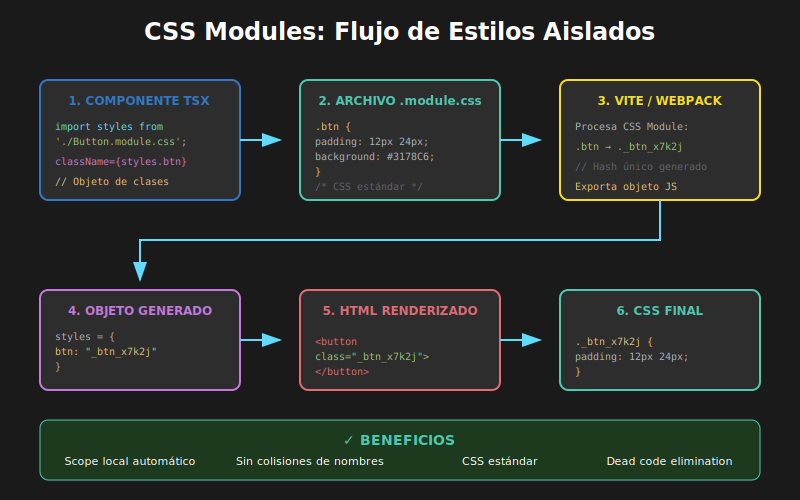

# 01 - CSS Modules con TypeScript



## 🎯 Objetivos

- Comprender qué son los CSS Modules y por qué usarlos
- Configurar CSS Modules en proyectos Vite + React
- Implementar estilos con scope local automático
- Crear tipos TypeScript para módulos CSS

---

## 📋 Contenido

### 1. ¿Qué son los CSS Modules?

CSS Modules es una técnica que **encapsula automáticamente** los estilos CSS, evitando colisiones de nombres de clases en aplicaciones grandes.

```css
/* Button.module.css */
.button {
  padding: 12px 24px;
  border-radius: 6px;
}

.primary {
  background-color: #3178c6;
  color: white;
}
```

```tsx
// Button.tsx
import styles from './Button.module.css';

// styles.button → "Button_button_x7d3f"
// styles.primary → "Button_primary_k9m2a"

const Button: React.FC = () => (
  <button className={styles.button}>Click me</button>
);
```

**El compilador transforma**:

- `.button` → `.Button_button_x7d3f` (hash único)
- Esto garantiza que **nunca habrá colisiones** con otras clases `.button`

---

### 2. Ventajas de CSS Modules

| Ventaja            | Descripción                                           |
| ------------------ | ----------------------------------------------------- |
| **Scope local**    | Las clases solo afectan al componente que las importa |
| **Sin colisiones** | Nombres únicos generados automáticamente              |
| **CSS estándar**   | No hay sintaxis nueva que aprender                    |
| **Composición**    | Reutilizar estilos con `composes`                     |
| **Tree shaking**   | Solo se incluye el CSS usado                          |
| **TypeScript**     | Se pueden tipar las clases                            |

---

### 3. Configuración en Vite

Vite soporta CSS Modules **por defecto**. Solo necesitas nombrar tus archivos con `.module.css`:

```
src/
├── components/
│   ├── Button/
│   │   ├── Button.tsx
│   │   └── Button.module.css
│   └── Card/
│       ├── Card.tsx
│       └── Card.module.css
```

---

### 4. Sintaxis Básica

#### Importar y usar clases

```tsx
// Card.tsx
import styles from './Card.module.css';

interface CardProps {
  title: string;
  children: React.ReactNode;
  variant?: 'default' | 'highlighted';
}

const Card: React.FC<CardProps> = ({
  title,
  children,
  variant = 'default',
}) => {
  return (
    <article className={`${styles.card} ${styles[variant]}`}>
      <h2 className={styles.title}>{title}</h2>
      <div className={styles.content}>{children}</div>
    </article>
  );
};

export default Card;
```

```css
/* Card.module.css */
.card {
  padding: 20px;
  border-radius: 8px;
  background-color: #ffffff;
  box-shadow: 0 2px 8px rgba(0, 0, 0, 0.1);
}

.default {
  border: 1px solid #e0e0e0;
}

.highlighted {
  border: 2px solid #3178c6;
  background-color: #f0f7ff;
}

.title {
  margin: 0 0 12px 0;
  font-size: 1.25rem;
  color: #1a1a1a;
}

.content {
  color: #4a4a4a;
  line-height: 1.6;
}
```

---

### 5. Clases Condicionales

#### Usando template literals

```tsx
const Button: React.FC<ButtonProps> = ({ variant, disabled, children }) => {
  const buttonClass = `
    ${styles.button}
    ${styles[variant]}
    ${disabled ? styles.disabled : ''}
  `.trim();

  return (
    <button
      className={buttonClass}
      disabled={disabled}>
      {children}
    </button>
  );
};
```

#### Usando una función helper

```tsx
// utils/classNames.ts
export const cn = (...classes: (string | undefined | false)[]): string => {
  return classes.filter(Boolean).join(' ');
};

// Uso
const Button: React.FC<ButtonProps> = ({ variant, disabled, children }) => (
  <button
    className={cn(styles.button, styles[variant], disabled && styles.disabled)}
    disabled={disabled}>
    {children}
  </button>
);
```

#### Usando la librería `clsx` (recomendado)

```bash
pnpm add clsx
```

```tsx
import clsx from 'clsx';
import styles from './Button.module.css';

const Button: React.FC<ButtonProps> = ({ variant, size, disabled }) => (
  <button
    className={clsx(styles.button, styles[variant], styles[size], {
      [styles.disabled]: disabled,
    })}>
    {children}
  </button>
);
```

---

### 6. Composición de Estilos

CSS Modules permite **componer** estilos de otros módulos:

```css
/* base.module.css */
.flexCenter {
  display: flex;
  align-items: center;
  justify-content: center;
}

.textPrimary {
  color: #3178c6;
}
```

```css
/* Button.module.css */
.button {
  composes: flexCenter from './base.module.css';
  padding: 12px 24px;
  border: none;
  cursor: pointer;
}

.primary {
  composes: textPrimary from './base.module.css';
  background-color: #3178c6;
  color: white; /* Sobrescribe textPrimary */
}
```

---

### 7. Variables CSS con CSS Modules

```css
/* variables.module.css */
:root {
  --color-primary: #3178c6;
  --color-secondary: #61dafb;
  --color-success: #4ade80;
  --color-error: #ef4444;
  --spacing-sm: 8px;
  --spacing-md: 16px;
  --spacing-lg: 24px;
  --radius-sm: 4px;
  --radius-md: 8px;
  --radius-lg: 16px;
}
```

```css
/* Button.module.css */
.button {
  padding: var(--spacing-sm) var(--spacing-md);
  border-radius: var(--radius-md);
  transition: all 0.2s ease;
}

.primary {
  background-color: var(--color-primary);
  color: white;
}

.primary:hover {
  background-color: color-mix(in srgb, var(--color-primary), black 10%);
}
```

---

### 8. TypeScript y CSS Modules

#### Problema: TypeScript no conoce las clases

```tsx
import styles from './Button.module.css';
// ❌ Error: Cannot find module './Button.module.css'
```

#### Solución 1: Declaración global

```typescript
// src/types/css.d.ts
declare module '*.module.css' {
  const classes: { [key: string]: string };
  export default classes;
}
```

#### Solución 2: Typed CSS Modules (más estricto)

```bash
pnpm add -D typed-css-modules
```

```bash
# Genera archivos .d.ts para cada .module.css
tcm src
```

Esto genera:

```typescript
// Button.module.css.d.ts
declare const styles: {
  readonly button: string;
  readonly primary: string;
  readonly secondary: string;
  readonly disabled: string;
};
export default styles;
```

Ahora TypeScript **autocompletará** y **validará** las clases:

```tsx
import styles from './Button.module.css';

// ✅ Autocompletado funciona
styles.button;
styles.primary;

// ❌ Error: Property 'nonExistent' does not exist
styles.nonExistent;
```

---

### 9. Organización de Archivos

#### Estructura recomendada

```
src/
├── components/
│   ├── Button/
│   │   ├── index.ts           # Re-export
│   │   ├── Button.tsx         # Componente
│   │   ├── Button.module.css  # Estilos
│   │   └── Button.test.tsx    # Tests
│   └── Card/
│       ├── index.ts
│       ├── Card.tsx
│       └── Card.module.css
├── styles/
│   ├── variables.css          # Variables globales
│   ├── reset.css              # CSS reset
│   └── base.module.css        # Estilos base componibles
└── types/
    └── css.d.ts               # Tipos para CSS Modules
```

---

### 10. CSS Modules vs Otras Soluciones

| Aspecto     | CSS Modules          | CSS Global | Styled Components |
| ----------- | -------------------- | ---------- | ----------------- |
| Scope       | Local automático     | Global     | Local automático  |
| Archivo     | `.module.css`        | `.css`     | `.tsx` (JS)       |
| Runtime     | Ninguno              | Ninguno    | Sí (JS)           |
| Bundle      | Solo CSS             | Solo CSS   | CSS + JS          |
| Composición | `composes`           | Manual     | `styled()`        |
| Dynamic     | Clases condicionales | Clases     | Props nativas     |

---

## ✅ Checklist de Verificación

- [ ] Entiendo la diferencia entre CSS global y CSS Modules
- [ ] Puedo crear archivos `.module.css` y usarlos en componentes
- [ ] Sé combinar múltiples clases condicionales
- [ ] Puedo usar `composes` para reutilizar estilos
- [ ] Configuré tipos TypeScript para CSS Modules
- [ ] Entiendo cuándo usar CSS Modules vs otras soluciones

---

## 📚 Recursos Adicionales

- [CSS Modules GitHub](https://github.com/css-modules/css-modules)
- [Vite CSS Features](https://vitejs.dev/guide/features.html#css-modules)
- [typed-css-modules](https://github.com/Quramy/typed-css-modules)
- [clsx - Utility for constructing className strings](https://github.com/lukeed/clsx)
