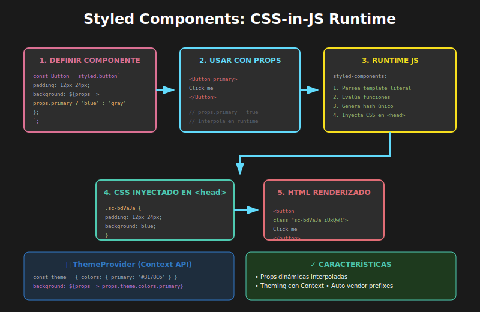

# 02 - Styled Components



## 🎯 Objetivos

- Comprender el paradigma CSS-in-JS y sus beneficios
- Crear componentes estilizados con tagged template literals
- Implementar estilos dinámicos con props
- Configurar theming para consistencia visual

---

## 📋 Contenido

### 1. ¿Qué es CSS-in-JS?

CSS-in-JS es un paradigma donde **escribimos CSS dentro de JavaScript**. Styled Components es la librería más popular para React.

```tsx
import styled from 'styled-components';

// Crea un componente <button> con estilos
const Button = styled.button`
  padding: 12px 24px;
  background-color: #3178c6;
  color: white;
  border: none;
  border-radius: 6px;
  cursor: pointer;

  &:hover {
    background-color: #2563eb;
  }
`;

// Uso: como cualquier componente React
const App = () => <Button>Click me</Button>;
```

---

### 2. Instalación

```bash
pnpm add styled-components
pnpm add -D @types/styled-components
```

---

### 3. Sintaxis Básica

#### Tagged Template Literals

```tsx
// La sintaxis usa template literals con el prefijo styled.element
const Title = styled.h1`
  font-size: 2rem;
  color: #1a1a1a;
  margin-bottom: 16px;
`;

const Paragraph = styled.p`
  font-size: 1rem;
  line-height: 1.6;
  color: #4a4a4a;
`;

const Container = styled.div`
  max-width: 800px;
  margin: 0 auto;
  padding: 20px;
`;
```

#### Anidamiento (como Sass)

```tsx
const Card = styled.article`
  padding: 20px;
  border-radius: 8px;
  background: white;
  box-shadow: 0 2px 8px rgba(0, 0, 0, 0.1);

  /* Selector anidado */
  h2 {
    margin: 0 0 12px 0;
    color: #1a1a1a;
  }

  /* Pseudo-clases */
  &:hover {
    box-shadow: 0 4px 16px rgba(0, 0, 0, 0.15);
  }

  /* Pseudo-elementos */
  &::before {
    content: '';
    display: block;
    height: 4px;
    background: linear-gradient(90deg, #3178c6, #61dafb);
  }
`;
```

---

### 4. Props Dinámicas

La gran ventaja de CSS-in-JS: **estilos que responden a props**.

#### Props básicas

```tsx
interface ButtonProps {
  $variant?: 'primary' | 'secondary' | 'danger';
  $size?: 'sm' | 'md' | 'lg';
}

const Button = styled.button<ButtonProps>`
  border: none;
  border-radius: 6px;
  cursor: pointer;
  font-weight: bold;

  /* Tamaño basado en prop */
  padding: ${({ $size }) => {
    switch ($size) {
      case 'sm':
        return '8px 16px';
      case 'lg':
        return '16px 32px';
      default:
        return '12px 24px';
    }
  }};

  font-size: ${({ $size }) => {
    switch ($size) {
      case 'sm':
        return '0.875rem';
      case 'lg':
        return '1.125rem';
      default:
        return '1rem';
    }
  }};

  /* Color basado en variante */
  background-color: ${({ $variant }) => {
    switch ($variant) {
      case 'secondary':
        return '#6b7280';
      case 'danger':
        return '#ef4444';
      default:
        return '#3178C6';
    }
  }};

  color: white;

  &:hover {
    opacity: 0.9;
  }
`;

// Uso
const App = () => (
  <>
    <Button>Default</Button>
    <Button
      $variant="secondary"
      $size="sm">
      Secondary Small
    </Button>
    <Button
      $variant="danger"
      $size="lg">
      Danger Large
    </Button>
  </>
);
```

> **Nota**: El prefijo `$` en props (`$variant`, `$size`) es una convención para indicar que son **transient props** que no se pasan al DOM.

---

### 5. Transient Props ($)

Las props con `$` **no se renderizan en el HTML**:

```tsx
// ❌ Sin $: la prop "variant" aparece en el DOM
<button variant="primary">Click</button>

// ✅ Con $: la prop "$variant" no aparece en el DOM
<button>Click</button>
```

```tsx
// Definir transient props con $
const Button = styled.button<{ $primary?: boolean }>`
  background: ${(props) => (props.$primary ? '#3178C6' : 'white')};
  color: ${(props) => (props.$primary ? 'white' : '#3178C6')};
`;

// La prop $primary no se pasa al <button> del DOM
<Button $primary>Primary Button</Button>;
```

---

### 6. Extender Componentes

Reutiliza estilos extendiendo componentes existentes:

```tsx
const BaseButton = styled.button`
  padding: 12px 24px;
  border: none;
  border-radius: 6px;
  cursor: pointer;
  font-weight: bold;
  transition: all 0.2s;
`;

// Extiende BaseButton con estilos adicionales
const PrimaryButton = styled(BaseButton)`
  background-color: #3178c6;
  color: white;

  &:hover {
    background-color: #2563eb;
  }
`;

const OutlineButton = styled(BaseButton)`
  background-color: transparent;
  border: 2px solid #3178c6;
  color: #3178c6;

  &:hover {
    background-color: #3178c6;
    color: white;
  }
`;

const IconButton = styled(BaseButton)`
  display: flex;
  align-items: center;
  gap: 8px;
  padding: 12px 20px;
`;
```

---

### 7. Estilos para Componentes Existentes

Estiliza componentes que ya existen (propios o de librerías):

```tsx
import { Link } from 'react-router-dom';

// Estilizar un componente existente
const StyledLink = styled(Link)`
  color: #3178c6;
  text-decoration: none;
  font-weight: 500;

  &:hover {
    text-decoration: underline;
  }
`;

// También funciona con componentes propios
const MyComponent: React.FC<{ className?: string }> = ({ className }) => (
  <div className={className}>Content</div>
);

const StyledMyComponent = styled(MyComponent)`
  padding: 20px;
  background: #f5f5f5;
`;
```

> **Importante**: El componente debe aceptar y pasar la prop `className`.

---

### 8. Theming

Crea un tema global para mantener consistencia:

```tsx
// theme.ts
export const theme = {
  colors: {
    primary: '#3178C6',
    secondary: '#61DAFB',
    success: '#4ade80',
    danger: '#ef4444',
    warning: '#f59e0b',
    text: {
      primary: '#1a1a1a',
      secondary: '#6b7280',
      muted: '#9ca3af',
    },
    background: {
      primary: '#ffffff',
      secondary: '#f9fafb',
      dark: '#1a1a1a',
    },
  },
  spacing: {
    xs: '4px',
    sm: '8px',
    md: '16px',
    lg: '24px',
    xl: '32px',
  },
  borderRadius: {
    sm: '4px',
    md: '8px',
    lg: '16px',
    full: '9999px',
  },
  fontSize: {
    xs: '0.75rem',
    sm: '0.875rem',
    md: '1rem',
    lg: '1.125rem',
    xl: '1.25rem',
    '2xl': '1.5rem',
  },
  shadows: {
    sm: '0 1px 2px rgba(0, 0, 0, 0.05)',
    md: '0 4px 6px rgba(0, 0, 0, 0.1)',
    lg: '0 10px 15px rgba(0, 0, 0, 0.1)',
  },
} as const;

export type Theme = typeof theme;
```

#### Configurar ThemeProvider

```tsx
// App.tsx
import { ThemeProvider } from 'styled-components';
import { theme } from './theme';

const App: React.FC = () => (
  <ThemeProvider theme={theme}>
    <YourApp />
  </ThemeProvider>
);
```

#### Usar el tema en componentes

```tsx
const Card = styled.div`
  padding: ${({ theme }) => theme.spacing.lg};
  background: ${({ theme }) => theme.colors.background.primary};
  border-radius: ${({ theme }) => theme.borderRadius.md};
  box-shadow: ${({ theme }) => theme.shadows.md};
`;

const Title = styled.h2`
  color: ${({ theme }) => theme.colors.text.primary};
  font-size: ${({ theme }) => theme.fontSize['2xl']};
  margin-bottom: ${({ theme }) => theme.spacing.md};
`;

const Button = styled.button<{ $variant?: 'primary' | 'danger' }>`
  padding: ${({ theme }) => `${theme.spacing.sm} ${theme.spacing.md}`};
  background: ${({ theme, $variant }) =>
    $variant === 'danger' ? theme.colors.danger : theme.colors.primary};
  color: white;
  border-radius: ${({ theme }) => theme.borderRadius.md};
`;
```

#### Tipar el tema para TypeScript

```tsx
// styled.d.ts
import 'styled-components';
import { Theme } from './theme';

declare module 'styled-components' {
  export interface DefaultTheme extends Theme {}
}
```

---

### 9. Estilos Globales

```tsx
import { createGlobalStyle } from 'styled-components';

const GlobalStyle = createGlobalStyle`
  *,
  *::before,
  *::after {
    box-sizing: border-box;
    margin: 0;
    padding: 0;
  }

  body {
    font-family: 'Inter', system-ui, sans-serif;
    background-color: ${({ theme }) => theme.colors.background.secondary};
    color: ${({ theme }) => theme.colors.text.primary};
    line-height: 1.6;
  }

  a {
    color: ${({ theme }) => theme.colors.primary};
    text-decoration: none;
  }
`;

// Usar en App
const App = () => (
  <ThemeProvider theme={theme}>
    <GlobalStyle />
    <YourApp />
  </ThemeProvider>
);
```

---

### 10. Patrones Avanzados

#### Componente con variantes usando objeto

```tsx
const buttonVariants = {
  primary: {
    bg: '#3178C6',
    color: 'white',
    hoverBg: '#2563eb',
  },
  secondary: {
    bg: '#6b7280',
    color: 'white',
    hoverBg: '#4b5563',
  },
  outline: {
    bg: 'transparent',
    color: '#3178C6',
    hoverBg: '#eff6ff',
  },
} as const;

type ButtonVariant = keyof typeof buttonVariants;

const Button = styled.button<{ $variant?: ButtonVariant }>`
  padding: 12px 24px;
  border: ${({ $variant }) =>
    $variant === 'outline' ? '2px solid #3178C6' : 'none'};
  border-radius: 6px;
  cursor: pointer;
  background-color: ${({ $variant = 'primary' }) =>
    buttonVariants[$variant].bg};
  color: ${({ $variant = 'primary' }) => buttonVariants[$variant].color};

  &:hover {
    background-color: ${({ $variant = 'primary' }) =>
      buttonVariants[$variant].hoverBg};
  }
`;
```

#### CSS helper functions

```tsx
import styled, { css } from 'styled-components';

// Mixin reutilizable
const flexCenter = css`
  display: flex;
  align-items: center;
  justify-content: center;
`;

const truncate = css`
  overflow: hidden;
  text-overflow: ellipsis;
  white-space: nowrap;
`;

// Usar en componentes
const CenteredBox = styled.div`
  ${flexCenter}
  min-height: 200px;
`;

const CardTitle = styled.h3`
  ${truncate}
  max-width: 200px;
`;
```

---

### 11. Styled Components vs CSS Modules

| Aspecto             | Styled Components             | CSS Modules          |
| ------------------- | ----------------------------- | -------------------- |
| **Sintaxis**        | CSS en JS (template literals) | CSS estándar         |
| **Props dinámicas** | Nativo                        | Clases condicionales |
| **Theming**         | Integrado                     | Variables CSS        |
| **Bundle size**     | +12KB runtime                 | 0KB runtime          |
| **Performance**     | Genera CSS en runtime         | CSS estático         |
| **Co-location**     | Estilos en mismo archivo      | Archivo separado     |
| **IDE support**     | Extensiones necesarias        | Nativo               |

---

## ✅ Checklist de Verificación

- [ ] Entiendo qué es CSS-in-JS y sus beneficios
- [ ] Puedo crear componentes con `styled.element`
- [ ] Sé usar props dinámicas con `$` (transient props)
- [ ] Puedo extender componentes existentes
- [ ] Configuré un tema con ThemeProvider
- [ ] Sé cuándo elegir Styled Components vs CSS Modules

---

## 📚 Recursos Adicionales

- [Styled Components Docs](https://styled-components.com/docs)
- [Styled Components Best Practices](https://styled-components.com/docs/faqs)
- [VS Code styled-components extension](https://marketplace.visualstudio.com/items?itemName=styled-components.vscode-styled-components)
