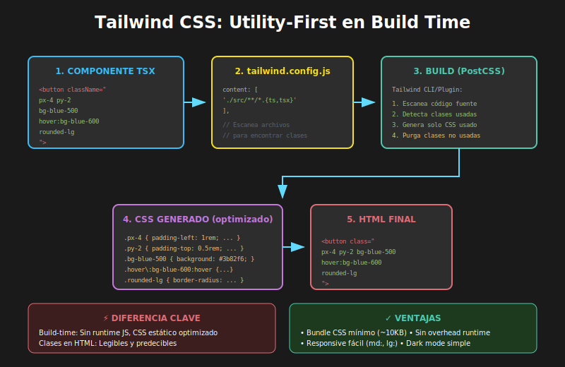

# 03 - Tailwind CSS en React



## 🎯 Objetivos

- Comprender el paradigma utility-first de Tailwind CSS
- Configurar Tailwind en proyectos Vite + React
- Aplicar clases utilitarias para estilos complejos
- Implementar diseño responsivo con prefijos de breakpoint

---

## 📋 Contenido

### 1. ¿Qué es Tailwind CSS?

Tailwind es un framework CSS **utility-first**: en lugar de escribir CSS personalizado, combinas clases predefinidas directamente en el HTML/JSX.

```tsx
// ❌ CSS tradicional: escribir estilos separados
<button className="my-button">Click me</button>

// ✅ Tailwind: clases utilitarias inline
<button className="px-4 py-2 bg-blue-600 text-white rounded-md hover:bg-blue-700">
  Click me
</button>
```

---

### 2. Instalación en Vite + React

```bash
# Instalar Tailwind y dependencias
pnpm add -D tailwindcss postcss autoprefixer

# Generar archivos de configuración
npx tailwindcss init -p
```

#### Configurar `tailwind.config.js`

```javascript
/** @type {import('tailwindcss').Config} */
export default {
  content: ['./index.html', './src/**/*.{js,ts,jsx,tsx}'],
  theme: {
    extend: {},
  },
  plugins: [],
};
```

#### Agregar directivas en CSS

```css
/* src/index.css */
@tailwind base;
@tailwind components;
@tailwind utilities;
```

#### Importar en main.tsx

```tsx
// src/main.tsx
import './index.css';
```

---

### 3. Clases Utilitarias Básicas

#### Espaciado (padding y margin)

```tsx
// Padding
<div className="p-4">        {/* padding: 1rem (16px) */}
<div className="px-4">       {/* padding-left/right: 1rem */}
<div className="py-2">       {/* padding-top/bottom: 0.5rem */}
<div className="pt-8">       {/* padding-top: 2rem */}

// Margin
<div className="m-4">        {/* margin: 1rem */}
<div className="mx-auto">    {/* margin-left/right: auto */}
<div className="mt-8 mb-4">  {/* margin-top: 2rem, margin-bottom: 1rem */}

// Gap (para flex/grid)
<div className="gap-4">      {/* gap: 1rem */}
```

**Escala de espaciado**:
| Clase | Valor |
|-------|-------|
| `0` | 0 |
| `1` | 0.25rem (4px) |
| `2` | 0.5rem (8px) |
| `4` | 1rem (16px) |
| `6` | 1.5rem (24px) |
| `8` | 2rem (32px) |
| `12` | 3rem (48px) |
| `16` | 4rem (64px) |

#### Colores

```tsx
// Texto
<p className="text-gray-900">     {/* color oscuro */}
<p className="text-blue-600">     {/* azul */}
<p className="text-red-500">      {/* rojo */}

// Fondo
<div className="bg-white">        {/* fondo blanco */}
<div className="bg-gray-100">     {/* fondo gris claro */}
<div className="bg-blue-600">     {/* fondo azul */}

// Bordes
<div className="border-gray-200"> {/* borde gris */}
<div className="border-blue-500"> {/* borde azul */}
```

#### Tipografía

```tsx
// Tamaño
<p className="text-sm">      {/* 0.875rem */}
<p className="text-base">    {/* 1rem */}
<p className="text-lg">      {/* 1.125rem */}
<p className="text-xl">      {/* 1.25rem */}
<p className="text-2xl">     {/* 1.5rem */}

// Peso
<p className="font-normal">  {/* 400 */}
<p className="font-medium">  {/* 500 */}
<p className="font-semibold">{/* 600 */}
<p className="font-bold">    {/* 700 */}

// Otros
<p className="leading-relaxed">  {/* line-height: 1.625 */}
<p className="tracking-wide">    {/* letter-spacing */}
<p className="text-center">      {/* text-align: center */}
<p className="uppercase">        {/* text-transform */}
```

---

### 4. Flexbox con Tailwind

```tsx
// Contenedor flex básico
<div className="flex">

// Dirección
<div className="flex flex-row">     {/* horizontal (default) */}
<div className="flex flex-col">     {/* vertical */}

// Justify content
<div className="flex justify-start">    {/* inicio */}
<div className="flex justify-center">   {/* centro */}
<div className="flex justify-between">  {/* espacio entre */}
<div className="flex justify-end">      {/* final */}

// Align items
<div className="flex items-start">   {/* inicio vertical */}
<div className="flex items-center">  {/* centro vertical */}
<div className="flex items-end">     {/* final vertical */}

// Ejemplo completo: centrado perfecto
<div className="flex items-center justify-center min-h-screen">
  <p>Centrado vertical y horizontal</p>
</div>

// Flex con gap
<div className="flex gap-4">
  <div>Item 1</div>
  <div>Item 2</div>
  <div>Item 3</div>
</div>
```

---

### 5. Grid con Tailwind

```tsx
// Grid básico
<div className="grid grid-cols-3 gap-4">
  <div>1</div>
  <div>2</div>
  <div>3</div>
</div>

// Grid responsivo
<div className="grid grid-cols-1 md:grid-cols-2 lg:grid-cols-3 gap-6">
  {items.map(item => <Card key={item.id} />)}
</div>

// Column span
<div className="grid grid-cols-4 gap-4">
  <div className="col-span-2">Ocupa 2 columnas</div>
  <div>1 columna</div>
  <div>1 columna</div>
</div>
```

---

### 6. Estados (hover, focus, active)

```tsx
// Hover
<button className="bg-blue-600 hover:bg-blue-700">
  Hover me
</button>

// Focus
<input className="border focus:border-blue-500 focus:ring-2 focus:ring-blue-200" />

// Active
<button className="bg-blue-600 active:bg-blue-800">
  Click me
</button>

// Disabled
<button className="bg-blue-600 disabled:bg-gray-400 disabled:cursor-not-allowed">
  Disabled
</button>

// Combinados
<button className="
  px-4 py-2
  bg-blue-600 text-white
  rounded-md
  hover:bg-blue-700
  focus:outline-none focus:ring-2 focus:ring-blue-500 focus:ring-offset-2
  active:bg-blue-800
  disabled:bg-gray-400 disabled:cursor-not-allowed
  transition-colors
">
  Complete Button
</button>
```

---

### 7. Diseño Responsivo

Tailwind usa breakpoints **mobile-first**:

| Prefijo   | Min-width | CSS                          |
| --------- | --------- | ---------------------------- |
| (ninguno) | 0px       | Móvil por defecto            |
| `sm:`     | 640px     | `@media (min-width: 640px)`  |
| `md:`     | 768px     | `@media (min-width: 768px)`  |
| `lg:`     | 1024px    | `@media (min-width: 1024px)` |
| `xl:`     | 1280px    | `@media (min-width: 1280px)` |
| `2xl:`    | 1536px    | `@media (min-width: 1536px)` |

```tsx
// Ejemplo: Card responsiva
<div className="
  p-4 md:p-6 lg:p-8
  text-sm md:text-base lg:text-lg
  grid grid-cols-1 md:grid-cols-2 lg:grid-cols-3
  gap-4 md:gap-6
">
  {/* En móvil: p-4, text-sm, 1 columna */}
  {/* En tablet: p-6, text-base, 2 columnas */}
  {/* En desktop: p-8, text-lg, 3 columnas */}
</div>

// Navbar responsiva
<nav className="flex flex-col md:flex-row md:items-center md:justify-between">
  <div className="text-xl font-bold">Logo</div>
  <div className="flex flex-col md:flex-row gap-2 md:gap-4 mt-4 md:mt-0">
    <a href="#">Home</a>
    <a href="#">About</a>
    <a href="#">Contact</a>
  </div>
</nav>
```

---

### 8. Componentes Reutilizables con Tailwind

#### Usando clsx para clases condicionales

```bash
pnpm add clsx
```

```tsx
import clsx from 'clsx';

interface ButtonProps {
  variant?: 'primary' | 'secondary' | 'danger';
  size?: 'sm' | 'md' | 'lg';
  disabled?: boolean;
  children: React.ReactNode;
  onClick?: () => void;
}

const Button: React.FC<ButtonProps> = ({
  variant = 'primary',
  size = 'md',
  disabled = false,
  children,
  onClick,
}) => {
  return (
    <button
      onClick={onClick}
      disabled={disabled}
      className={clsx(
        // Base styles
        'font-semibold rounded-md transition-colors focus:outline-none focus:ring-2 focus:ring-offset-2',

        // Size variants
        {
          'px-3 py-1.5 text-sm': size === 'sm',
          'px-4 py-2 text-base': size === 'md',
          'px-6 py-3 text-lg': size === 'lg',
        },

        // Color variants
        {
          'bg-blue-600 text-white hover:bg-blue-700 focus:ring-blue-500':
            variant === 'primary',
          'bg-gray-200 text-gray-800 hover:bg-gray-300 focus:ring-gray-400':
            variant === 'secondary',
          'bg-red-600 text-white hover:bg-red-700 focus:ring-red-500':
            variant === 'danger',
        },

        // Disabled state
        {
          'opacity-50 cursor-not-allowed': disabled,
        },
      )}>
      {children}
    </button>
  );
};
```

#### Usando @apply para extraer clases (con moderación)

```css
/* src/index.css */
@tailwind base;
@tailwind components;
@tailwind utilities;

@layer components {
  .btn {
    @apply px-4 py-2 font-semibold rounded-md transition-colors;
    @apply focus:outline-none focus:ring-2 focus:ring-offset-2;
  }

  .btn-primary {
    @apply bg-blue-600 text-white hover:bg-blue-700 focus:ring-blue-500;
  }

  .btn-secondary {
    @apply bg-gray-200 text-gray-800 hover:bg-gray-300 focus:ring-gray-400;
  }

  .card {
    @apply p-6 bg-white rounded-lg shadow-md;
  }
}
```

```tsx
// Uso
<button className="btn btn-primary">Primary</button>
<button className="btn btn-secondary">Secondary</button>
<div className="card">Card content</div>
```

> **Nota**: Usa `@apply` con moderación. La filosofía de Tailwind favorece las clases utilitarias inline.

---

### 9. Personalizar Tailwind

```javascript
// tailwind.config.js
/** @type {import('tailwindcss').Config} */
export default {
  content: ['./index.html', './src/**/*.{js,ts,jsx,tsx}'],
  theme: {
    extend: {
      // Agregar colores personalizados
      colors: {
        brand: {
          50: '#eff6ff',
          100: '#dbeafe',
          500: '#3178C6',
          600: '#2563eb',
          700: '#1d4ed8',
        },
        react: '#61DAFB',
        typescript: '#3178C6',
      },

      // Agregar fuentes
      fontFamily: {
        sans: ['Inter', 'system-ui', 'sans-serif'],
        mono: ['Fira Code', 'monospace'],
      },

      // Agregar espaciado
      spacing: {
        18: '4.5rem',
        88: '22rem',
      },

      // Agregar breakpoints
      screens: {
        xs: '475px',
        '3xl': '1920px',
      },
    },
  },
  plugins: [],
};
```

```tsx
// Usar colores personalizados
<div className="bg-brand-500 text-white">Brand color</div>
<div className="text-react">React cyan</div>
<div className="text-typescript">TypeScript blue</div>
```

---

### 10. Tailwind con TypeScript

#### Plugin de autocompletado (VS Code)

Instala la extensión **Tailwind CSS IntelliSense** para:

- Autocompletado de clases
- Hover para ver CSS generado
- Linting de clases incorrectas

#### Tipar clases con CVA (Class Variance Authority)

```bash
pnpm add class-variance-authority
```

```tsx
import { cva, type VariantProps } from 'class-variance-authority';

const buttonVariants = cva(
  // Base classes
  'font-semibold rounded-md transition-colors focus:outline-none focus:ring-2',
  {
    variants: {
      variant: {
        primary: 'bg-blue-600 text-white hover:bg-blue-700',
        secondary: 'bg-gray-200 text-gray-800 hover:bg-gray-300',
        danger: 'bg-red-600 text-white hover:bg-red-700',
      },
      size: {
        sm: 'px-3 py-1.5 text-sm',
        md: 'px-4 py-2 text-base',
        lg: 'px-6 py-3 text-lg',
      },
    },
    defaultVariants: {
      variant: 'primary',
      size: 'md',
    },
  }
);

// Los tipos se infieren automáticamente
interface ButtonProps extends VariantProps<typeof buttonVariants> {
  children: React.ReactNode;
  onClick?: () => void;
}

const Button: React.FC<ButtonProps> = ({ variant, size, children, onClick }) => (
  <button className={buttonVariants({ variant, size })} onClick={onClick}>
    {children}
  </button>
);

// Uso con tipos seguros
<Button variant="primary" size="lg">Click me</Button>
<Button variant="danger">Delete</Button> // size="md" por defecto
```

---

### 11. Comparativa Final

| Aspecto               | CSS Modules    | Styled Components | Tailwind           |
| --------------------- | -------------- | ----------------- | ------------------ |
| **Paradigma**         | CSS separado   | CSS-in-JS         | Utility-first      |
| **Curva aprendizaje** | Baja           | Media             | Media              |
| **Bundle size**       | Solo CSS usado | +12KB runtime     | ~10KB (purgado)    |
| **Customización**     | Variables CSS  | Theme JS          | Config JS          |
| **Responsive**        | Media queries  | Media queries     | Prefijos inline    |
| **Ideal para**        | Apps medianas  | Design systems    | Prototipado rápido |

---

## ✅ Checklist de Verificación

- [ ] Instalé y configuré Tailwind en un proyecto Vite
- [ ] Entiendo las clases de espaciado, colores y tipografía
- [ ] Puedo crear layouts con Flexbox y Grid de Tailwind
- [ ] Sé usar estados (hover, focus) y responsive (sm:, md:, lg:)
- [ ] Puedo crear componentes reutilizables con clsx o cva
- [ ] Configuré colores y fuentes personalizados

---

## 📚 Recursos Adicionales

- [Tailwind CSS Documentation](https://tailwindcss.com/docs)
- [Tailwind CSS Cheat Sheet](https://nerdcave.com/tailwind-cheat-sheet)
- [Tailwind UI (components)](https://tailwindui.com/)
- [Headless UI (accesible)](https://headlessui.com/)
- [Class Variance Authority](https://cva.style/docs)
