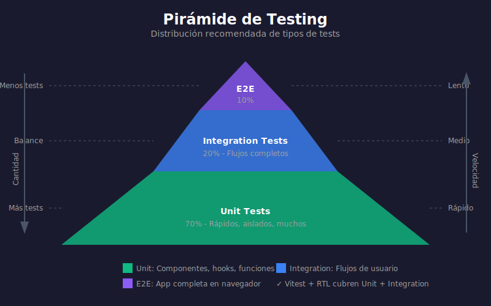
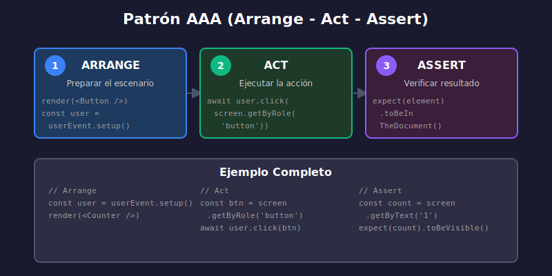

# 01 - Fundamentos de Testing en React

## 🎯 Objetivos de Aprendizaje

- Comprender por qué testeamos aplicaciones
- Conocer los tipos de tests y sus diferencias
- Entender la pirámide de testing
- Aplicar el principio "Test User Behavior"

---

## 📖 ¿Por Qué Testear?

El testing es una práctica fundamental en desarrollo profesional que aporta:

| Beneficio         | Descripción                                        |
| ----------------- | -------------------------------------------------- |
| **Confianza**     | Certeza de que el código funciona como se espera   |
| **Refactoring**   | Modificar código sin miedo a romper funcionalidad  |
| **Documentación** | Los tests documentan el comportamiento esperado    |
| **Regresiones**   | Detectar bugs introducidos por cambios             |
| **Diseño**        | Escribir tests primero mejora el diseño del código |

### El Costo de No Testear

```
Sin tests:
- Bug en producción → Usuario afectado → Pérdida de confianza
- Miedo a refactorizar → Código legacy → Deuda técnica
- "Funciona en mi máquina" → Problemas en deploy

Con tests:
- Bug detectado en CI → Fix antes de producción
- Refactoring seguro → Código limpio y mantenible
- Comportamiento verificado → Deploys confiables
```

---

## 🔺 Pirámide de Testing

La pirámide de testing es una estrategia que define cuántos tests de cada tipo deberías tener:



```
        /\
       /  \      E2E Tests (pocos)
      /----\     - Cypress, Playwright
     /      \    - Lentos, costosos
    /--------\   - Testean flujos completos
   /          \
  /  Integration \  Integration Tests (algunos)
 /--------------\   - Vitest + RTL
/                \  - Velocidad media
/------------------\ - Testean interacción entre partes

    Unit Tests (muchos)
    - Vitest
    - Rápidos, baratos
    - Testean funciones aisladas
```

### Tipos de Tests

#### 1. Unit Tests (Tests Unitarios)

Testean una **unidad aislada** de código (función, hook, utilidad).

```typescript
// utils/formatPrice.ts
export function formatPrice(price: number): string {
  return new Intl.NumberFormat('es-CO', {
    style: 'currency',
    currency: 'COP',
  }).format(price);
}

// utils/formatPrice.test.ts
import { describe, test, expect } from 'vitest';
import { formatPrice } from './formatPrice';

describe('formatPrice', () => {
  test('formatea precio en pesos colombianos', () => {
    expect(formatPrice(1000)).toBe('$ 1.000');
  });

  test('maneja decimales correctamente', () => {
    expect(formatPrice(1500.5)).toBe('$ 1.501'); // Redondea
  });

  test('maneja cero', () => {
    expect(formatPrice(0)).toBe('$ 0');
  });
});
```

**Características:**

- ✅ Muy rápidos (milisegundos)
- ✅ Fáciles de escribir y mantener
- ✅ Aíslan errores precisamente
- ❌ No verifican integración entre partes

#### 2. Integration Tests (Tests de Integración)

Testean **cómo interactúan** múltiples partes del sistema.

```typescript
// En React: testear componente con sus hijos, hooks, context
import { render, screen } from '@testing-library/react';
import userEvent from '@testing-library/user-event';
import { ItemList } from './ItemList';

describe('ItemList', () => {
  test('agrega item a la lista cuando se hace submit', async () => {
    const user = userEvent.setup();
    render(<ItemList />);

    // Interactuar como usuario
    await user.type(screen.getByRole('textbox'), 'Nuevo item');
    await user.click(screen.getByRole('button', { name: /agregar/i }));

    // Verificar resultado
    expect(screen.getByText('Nuevo item')).toBeInTheDocument();
  });
});
```

**Características:**

- ✅ Verifican comportamiento real
- ✅ Detectan problemas de integración
- ⚠️ Más lentos que unitarios
- ⚠️ Más difíciles de debuggear

#### 3. End-to-End Tests (E2E)

Testean la aplicación **completa** desde la perspectiva del usuario.

```typescript
// Cypress o Playwright
test('usuario puede completar una compra', async ({ page }) => {
  await page.goto('/productos');
  await page.click('text=Agregar al carrito');
  await page.click('text=Ir al carrito');
  await page.fill('#email', 'test@example.com');
  await page.click('text=Finalizar compra');
  await expect(page.locator('text=Compra exitosa')).toBeVisible();
});
```

**Características:**

- ✅ Verifican flujos completos
- ✅ Más cercanos a experiencia real
- ❌ Lentos (segundos o minutos)
- ❌ Frágiles (fallan por cambios de UI)
- ❌ Difíciles de mantener

---

## 🎯 Test User Behavior, Not Implementation

Este es el principio más importante de testing en React:

> **Testea lo que el usuario ve y hace, no cómo lo implementaste**

### ❌ Incorrecto: Testear Implementación

```typescript
// MAL: Testea detalles internos
test('incrementa el state counter', () => {
  const { result } = renderHook(() => useCounter());

  // Accediendo a internals del hook
  expect(result.current.state.count).toBe(0);
  act(() => result.current.dispatch({ type: 'INCREMENT' }));
  expect(result.current.state.count).toBe(1);
});
```

**Problemas:**

- Si cambias la implementación (useState → useReducer), el test falla
- El test no verifica que el usuario vea el cambio
- Acoplado a detalles internos

### ✅ Correcto: Testear Comportamiento

```typescript
// BIEN: Testea desde perspectiva del usuario
test('incrementa el contador cuando se hace click', async () => {
  const user = userEvent.setup();
  render(<Counter />);

  // El usuario ve "0" inicialmente
  expect(screen.getByText('0')).toBeInTheDocument();

  // El usuario hace click en el botón
  await user.click(screen.getByRole('button', { name: /incrementar/i }));

  // El usuario ve "1"
  expect(screen.getByText('1')).toBeInTheDocument();
});
```

**Beneficios:**

- Si refactorizas la implementación, el test sigue pasando
- Verifica lo que realmente importa: la experiencia del usuario
- Más resistente a cambios

### Checklist para Buenos Tests

Pregúntate antes de escribir un test:

- [ ] ¿Estoy testeando lo que el usuario ve/hace?
- [ ] ¿El test pasaría si cambio la implementación pero mantengo el comportamiento?
- [ ] ¿El test describe un caso de uso real?
- [ ] ¿Estoy usando queries accesibles?

---

## 📝 Anatomía de un Test

```typescript
import { describe, test, expect, beforeEach } from 'vitest';

// describe: agrupa tests relacionados
describe('Calculator', () => {
  // beforeEach: setup antes de cada test
  beforeEach(() => {
    // Preparar estado inicial si es necesario
  });

  // test (o it): un caso de prueba
  test('suma dos números correctamente', () => {
    // Arrange: preparar
    const a = 2;
    const b = 3;

    // Act: ejecutar
    const result = add(a, b);

    // Assert: verificar
    expect(result).toBe(5);
  });

  // Otro test
  test('maneja números negativos', () => {
    expect(add(-1, 1)).toBe(0);
  });
});
```

### Patrón AAA (Arrange-Act-Assert)



| Fase    | Descripción                  | Ejemplo                            |
| ------- | ---------------------------- | ---------------------------------- |
| Arrange | Preparar datos y condiciones | `const user = { name: 'Juan' }`    |
| Act     | Ejecutar la acción a testear | `render(<Profile user={user} />)`  |
| Assert  | Verificar el resultado       | `expect(screen.getByText('Juan'))` |

---

## 🧪 ¿Qué Testear en React?

### Prioridad Alta (Siempre testear)

1. **Lógica de negocio crítica**
   - Cálculos, validaciones, transformaciones
2. **Interacciones de usuario importantes**
   - Formularios, clicks que modifican estado
3. **Componentes reutilizables**
   - Button, Input, Card (design system)

### Prioridad Media (Testear si hay tiempo)

4. **Flujos de usuario completos**
   - Agregar item → ver en lista → eliminar
5. **Edge cases y manejo de errores**
   - Listas vacías, errores de red

### Prioridad Baja (Opcional)

6. **Estilos y layout**
   - Mejor usar visual regression testing
7. **Componentes simples sin lógica**
   - Wrappers, containers puros

---

## ✅ Checklist de Verificación

- [ ] Entiendo la diferencia entre unit, integration y e2e tests
- [ ] Conozco la pirámide de testing y su propósito
- [ ] Puedo aplicar el principio "test user behavior"
- [ ] Sé identificar qué testear con prioridad alta
- [ ] Entiendo el patrón AAA

---

## 🔗 Navegación

- ➡️ [02 - Configuración de Vitest](./02-vitest-configuracion.md)
- 🏠 [Inicio Semana 14](../README.md)
