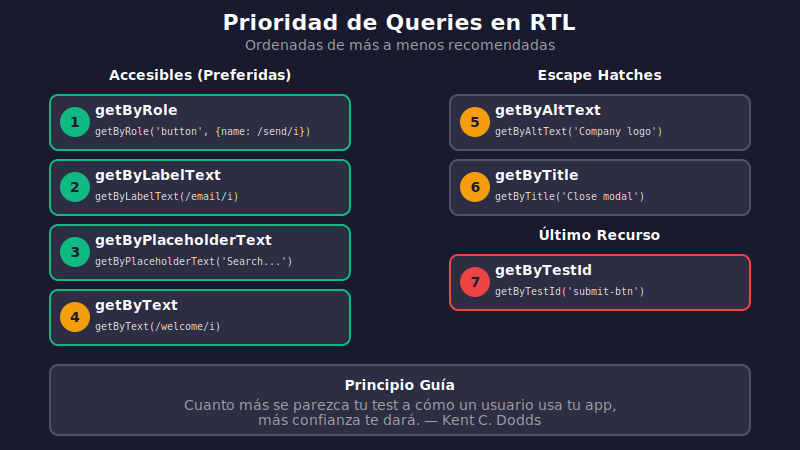

# 03 - React Testing Library

## 🎯 Objetivos de Aprendizaje

- Entender la filosofía de React Testing Library
- Dominar las queries por prioridad de accesibilidad
- Usar user-event para simular interacciones
- Aplicar async utilities para operaciones asíncronas

---

## 📖 ¿Qué es React Testing Library?

[React Testing Library](https://testing-library.com/docs/react-testing-library/intro/) (RTL) es una librería que facilita testear componentes React de manera que reflejen cómo los usuarios interactúan con la aplicación.

### Filosofía Principal

> "Cuanto más se parezcan tus tests a cómo se usa tu software, más confianza te darán."
> — Kent C. Dodds

| Principio                    | Descripción                                      |
| ---------------------------- | ------------------------------------------------ |
| **Test user behavior**       | No testees implementación, testea comportamiento |
| **Accesibilidad primero**    | Queries que usan roles accesibles                |
| **Evitar detalles internos** | No accedas a state o props directamente          |

---

## 🔍 Queries: Cómo Encontrar Elementos

RTL proporciona diferentes queries para encontrar elementos. **El orden importa** - usa la query más accesible posible.

### Prioridad de Queries (Mejor a Peor)



#### 1. Queries Accesibles (USAR SIEMPRE QUE SEA POSIBLE)

```typescript
// ✅ getByRole - La mejor opción, usa roles ARIA
screen.getByRole('button', { name: /enviar/i });
screen.getByRole('textbox', { name: /email/i });
screen.getByRole('heading', { level: 1 });
screen.getByRole('checkbox', { checked: true });

// ✅ getByLabelText - Ideal para inputs de formularios
screen.getByLabelText(/correo electrónico/i);

// ✅ getByPlaceholderText - Cuando no hay label
screen.getByPlaceholderText(/buscar/i);

// ✅ getByText - Para contenido textual
screen.getByText(/bienvenido/i);
screen.getByText('Guardar cambios');

// ✅ getByDisplayValue - Para valores de inputs
screen.getByDisplayValue('valor actual');
```

#### 2. Queries Semánticas

```typescript
// ⚠️ getByAltText - Para imágenes
screen.getByAltText(/logo de la empresa/i);

// ⚠️ getByTitle - Para elementos con title
screen.getByTitle(/cerrar modal/i);
```

#### 3. Queries de Último Recurso

```typescript
// ❌ getByTestId - Solo cuando no hay otra opción
screen.getByTestId('custom-element');
```

### Variantes de Queries

| Prefijo      | Cantidad | Async  | Uso                                |
| ------------ | -------- | ------ | ---------------------------------- |
| `getBy`      | 1        | No     | Elemento debe existir              |
| `getAllBy`   | 1+       | No     | Múltiples elementos deben existir  |
| `queryBy`    | 0-1      | No     | Verificar que NO existe            |
| `queryAllBy` | 0+       | No     | Puede no existir ninguno           |
| `findBy`     | 1        | **Sí** | Espera que aparezca (async)        |
| `findAllBy`  | 1+       | **Sí** | Espera múltiples elementos (async) |

### Ejemplos de Uso

```typescript
import { render, screen } from '@testing-library/react';

// getBy - Lanza error si no existe o hay más de uno
const button = screen.getByRole('button', { name: /submit/i });

// queryBy - Retorna null si no existe (útil para verificar ausencia)
const modal = screen.queryByRole('dialog');
expect(modal).not.toBeInTheDocument();

// findBy - Retorna Promise, espera hasta 1000ms por defecto
const data = await screen.findByText(/cargado/i);

// getAllBy - Retorna array, lanza error si está vacío
const items = screen.getAllByRole('listitem');
expect(items).toHaveLength(3);
```

---

## 👆 User Events: Simulando Interacciones

`@testing-library/user-event` simula interacciones reales del usuario, más realista que `fireEvent`.

### Setup

```typescript
import userEvent from '@testing-library/user-event';

// SIEMPRE crear una instancia de user
const user = userEvent.setup();
```

### Eventos Comunes

```typescript
import { render, screen } from '@testing-library/react';
import userEvent from '@testing-library/user-event';

test('interacciones de usuario', async () => {
  const user = userEvent.setup();
  render(<MyComponent />);

  // Click
  await user.click(screen.getByRole('button'));

  // Doble click
  await user.dblClick(element);

  // Hover
  await user.hover(element);
  await user.unhover(element);

  // Escribir texto
  await user.type(screen.getByRole('textbox'), 'Hola mundo');

  // Limpiar y escribir
  await user.clear(screen.getByRole('textbox'));
  await user.type(screen.getByRole('textbox'), 'Nuevo texto');

  // Seleccionar texto y reemplazar
  await user.tripleClick(screen.getByRole('textbox')); // Selecciona todo
  await user.keyboard('Texto reemplazado');

  // Teclado
  await user.keyboard('{Enter}');
  await user.keyboard('{Escape}');
  await user.keyboard('{Tab}');
  await user.keyboard('{Shift>}{Tab}{/Shift}'); // Shift+Tab

  // Seleccionar option
  await user.selectOptions(
    screen.getByRole('combobox'),
    screen.getByRole('option', { name: 'Opción 2' })
  );

  // Checkbox/Radio
  await user.click(screen.getByRole('checkbox'));
});
```

### Diferencia entre userEvent y fireEvent

```typescript
// ❌ fireEvent: dispara solo el evento especificado
fireEvent.click(button);

// ✅ userEvent: simula la secuencia completa de eventos
// pointerdown → pointerup → click (como un usuario real)
await user.click(button);

// ❌ fireEvent.change: solo dispara change
fireEvent.change(input, { target: { value: 'text' } });

// ✅ userEvent.type: dispara focus, keydown, keypress, input, keyup por cada caracter
await user.type(input, 'text');
```

---

## ⏳ Async Utilities

Para manejar actualizaciones asíncronas (fetching, efectos, etc.).

### waitFor

Espera hasta que la callback no lance error:

```typescript
import { render, screen, waitFor } from '@testing-library/react';

test('muestra datos después de cargar', async () => {
  render(<DataComponent />);

  // Espera hasta que aparezca
  await waitFor(() => {
    expect(screen.getByText(/datos cargados/i)).toBeInTheDocument();
  });
});

// Con opciones
await waitFor(
  () => {
    expect(element).toBeVisible();
  },
  {
    timeout: 3000,      // Máximo tiempo de espera
    interval: 100,      // Intervalo entre reintentos
  }
);
```

### findBy (combinación de getBy + waitFor)

```typescript
// Equivalente a waitFor + getBy
const element = await screen.findByText(/cargado/i);

// Con timeout personalizado
const element = await screen.findByText(/cargado/i, {}, { timeout: 3000 });
```

### waitForElementToBeRemoved

```typescript
import { waitForElementToBeRemoved } from '@testing-library/react';

test('el loading desaparece', async () => {
  render(<LoadingComponent />);

  // Espera a que el elemento desaparezca
  await waitForElementToBeRemoved(() => screen.queryByText(/cargando/i));

  // Ahora verifica el contenido final
  expect(screen.getByText(/datos/i)).toBeInTheDocument();
});
```

---

## 🧪 Ejemplo Completo

```typescript
// components/LoginForm.tsx
interface LoginFormProps {
  onSubmit: (email: string, password: string) => void;
}

export function LoginForm({ onSubmit }: LoginFormProps) {
  const [email, setEmail] = useState('');
  const [password, setPassword] = useState('');
  const [error, setError] = useState('');

  const handleSubmit = (e: React.FormEvent) => {
    e.preventDefault();
    if (!email || !password) {
      setError('Todos los campos son requeridos');
      return;
    }
    onSubmit(email, password);
  };

  return (
    <form onSubmit={handleSubmit}>
      <label>
        Email
        <input
          type="email"
          value={email}
          onChange={(e) => setEmail(e.target.value)}
        />
      </label>
      <label>
        Contraseña
        <input
          type="password"
          value={password}
          onChange={(e) => setPassword(e.target.value)}
        />
      </label>
      {error && <p role="alert">{error}</p>}
      <button type="submit">Iniciar Sesión</button>
    </form>
  );
}
```

```typescript
// components/LoginForm.test.tsx
import { render, screen } from '@testing-library/react';
import userEvent from '@testing-library/user-event';
import { vi, describe, test, expect } from 'vitest';
import { LoginForm } from './LoginForm';

describe('LoginForm', () => {
  test('renderiza campos de email y password', () => {
    render(<LoginForm onSubmit={() => {}} />);

    expect(screen.getByLabelText(/email/i)).toBeInTheDocument();
    expect(screen.getByLabelText(/contraseña/i)).toBeInTheDocument();
    expect(screen.getByRole('button', { name: /iniciar sesión/i })).toBeInTheDocument();
  });

  test('muestra error cuando se envía vacío', async () => {
    const user = userEvent.setup();
    render(<LoginForm onSubmit={() => {}} />);

    await user.click(screen.getByRole('button', { name: /iniciar sesión/i }));

    expect(screen.getByRole('alert')).toHaveTextContent(/todos los campos son requeridos/i);
  });

  test('llama onSubmit con email y password', async () => {
    const user = userEvent.setup();
    const handleSubmit = vi.fn();
    render(<LoginForm onSubmit={handleSubmit} />);

    await user.type(screen.getByLabelText(/email/i), 'test@example.com');
    await user.type(screen.getByLabelText(/contraseña/i), 'password123');
    await user.click(screen.getByRole('button', { name: /iniciar sesión/i }));

    expect(handleSubmit).toHaveBeenCalledWith('test@example.com', 'password123');
    expect(handleSubmit).toHaveBeenCalledTimes(1);
  });

  test('no muestra error cuando los campos están llenos', async () => {
    const user = userEvent.setup();
    render(<LoginForm onSubmit={() => {}} />);

    await user.type(screen.getByLabelText(/email/i), 'test@example.com');
    await user.type(screen.getByLabelText(/contraseña/i), 'password123');
    await user.click(screen.getByRole('button', { name: /iniciar sesión/i }));

    expect(screen.queryByRole('alert')).not.toBeInTheDocument();
  });
});
```

---

## 📋 Matchers de jest-dom

`@testing-library/jest-dom` agrega matchers útiles para el DOM:

```typescript
// Visibilidad
expect(element).toBeVisible();
expect(element).toBeInTheDocument();
expect(element).toBeEmptyDOMElement();

// Estado de formularios
expect(input).toBeDisabled();
expect(input).toBeEnabled();
expect(input).toBeRequired();
expect(input).toBeValid();
expect(input).toBeInvalid();
expect(checkbox).toBeChecked();

// Contenido
expect(element).toHaveTextContent(/texto/i);
expect(element).toHaveTextContent('Texto exacto');
expect(input).toHaveValue('valor');
expect(input).toHaveDisplayValue('valor visible');

// Atributos
expect(element).toHaveAttribute('href', '/path');
expect(element).toHaveClass('my-class');
expect(element).toHaveStyle({ color: 'red' });

// Focus
expect(input).toHaveFocus();
```

---

## ✅ Checklist de Verificación

- [ ] Entiendo la filosofía de RTL (test user behavior)
- [ ] Conozco la prioridad de queries
- [ ] Uso getByRole como primera opción
- [ ] Sé cuándo usar queryBy vs getBy vs findBy
- [ ] Puedo simular interacciones con userEvent
- [ ] Entiendo waitFor y findBy para async
- [ ] Conozco los matchers de jest-dom

---

## 🔗 Navegación

- ⬅️ [02 - Configuración de Vitest](./02-vitest-configuracion.md)
- ➡️ [04 - Testing de Componentes](./04-testing-componentes.md)
- 🏠 [Inicio Semana 14](../README.md)
